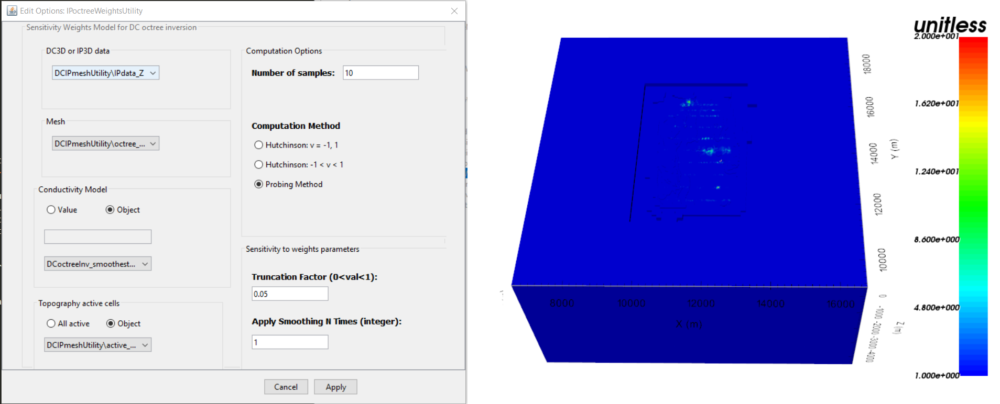
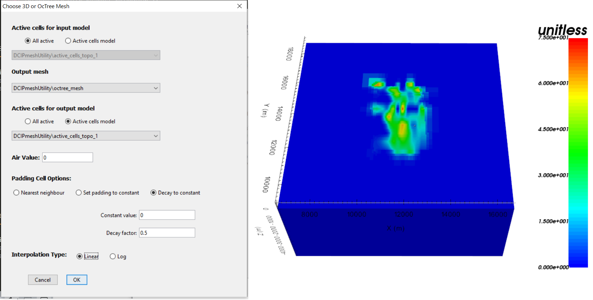

.. _comprehensive_workflow_dcip_11:

.. include:: <isonum.txt>

IP OcTree Inversion: Weights and Reference Models
=================================================

Weights are used to reduce artifacts causes by the sensitivity of the data to cell near electrodes. Starting and reference models can be used to constrain the data with a-priori information. In this section we demonstrate how to:

    - Create near-surface interface weights
    - Create sensitivity weights for the IP inversion
    - Create a starting/reference model from the batch 2D inversion result

.. _comprehensive_workflow_dcip_11_interface:

Near-Surface Interface Weighting
--------------------------------

When inverting IP data, the code has a tendency to place chargeable structures near electrode locations due to the sensitivity of the data to those locations. One way to counteract this problem is to generate interface weights. By forcing lateral smoothness within the top few layers of cells, we can limit near-surface artifacts and force the inversion to place chargeable structures at the appropriate depths. To create interface weights:

    - :ref:`Create and interface weights utility <createinterfWeights>`
    - Use :ref:`edit options <utilEditOptions>` and set the following parameters:

        - set the OcTree mesh
        - set the model
        - set as *log model* for DC inversion
        - set topography as the active cells model
        - set number of layers and corresponding weights
        - for inhomogeous background models, set the *face value* and *face tolerance*

    - :ref:`Run the utility <utilRun>`
    - :ref:`Load results <utilLoadResults>`

**For the tutorial data**, we set 2 layers of interface weights with values of 10 and 4 (same as in the DC inversion). Earlier attempts to invert the data used larger interfaces weights and more layers, however the inversion struggled to reach target misfit in this case. It was thought that by applying very large interface weights, we were not able to recover near-surface inhomogeneities that exist in the true conductivity model.

.. _comprehensive_workflow_dcip_11_sens:

Sensitivity Weighting for IP Inversion
--------------------------------------

To counteract issues related to the sensitivity of the data with respect to cells near electrodes, you may choose to implement sensitivity weighting. To create a cell weights model for the IP inversion using the sensitivities, do the following:

    - :ref:`Create a DCIP sensitivity weights utility <createDCsensitivities>`
    - Use :ref:`edit options <utilEditOptions_DCsensitivity>` to set the parameters and click *Apply*
    - Write the input files
    - Run *sensitivities*
    - Run *sens2weights*
    - :ref:`Load results <utilLoadResults>`

**For the tutorial data** the input parameters and sensitivity weights are shown below. 

.. _comprehensive_workflow_dcip_11_mref:

Starting/Reference Model from Batch 2D Inversion
------------------------------------------------

In the :ref:`2D batch inversion <comprehensive_workflow_dcip_6>` section, we generated a 3D chargeability model by interpolating the set of 2D slices. If we have confidence in the structures recovered from the batch 2D inversion, we may want to use it as a starting and/or reference model. To do this, we must interpolate the 3D tensor model onto the :ref:`OcTree mesh we generated in an earlier section <comprehensive_workflow_dcip_7>` . To accomplish this, we use:

    - :ref:`Interpolate with nearest neighbour <objectFunctionalityNearest3D>`

**For the tutorial data**, the parameters used and the resulting OcTree model are shown below. When *nearest neighbour* was used for the *padding cell options* , the padding in the reference model contained large anomalous structures that impacted the predicted data and created obvious artifacts in the inversion result. When using *set padding to constant* , the large discontinuity created at the edge of the core mesh region greatly impacted the regularization. The inversion tried to smooth this out at the expense of evenly fitting the data. It was only by using the *decay to constant* option that artifacts were minimized and acceptable convergence was observed.

    Interpolation parameters and reference/starting chargeability model on OcTree mesh for tutorial data.
