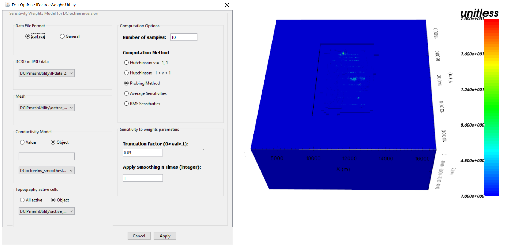

.. _comprehensive_workflow_dcip_11:

.. include:: <isonum.txt>

IP OcTree Inversion: Weights and Reference Models
=================================================

In this section we demonstrate how to:

	- Create a starting/reference model from the batch 2D inversion result
	- Create near-surface interface weights
	- Create sensitivity weights for the IP inversion

.. _comprehensive_workflow_dcip_11_interface:

Near-Surface Interface Weighting
--------------------------------

When inverting IP data, the code has a tendency to place conductive structures near electrode locations due to the sensitivity of the data to those locations. One way to counteract this problem is to generate interface weights. By forcing lateral smoothness within the top few layers of cells, we can limit the artifacts and force the inversion to place conductive structures at the appropriate depths. **For the tutorial data** , we used the same interface weights that were used for the DC inversion.

    - :ref:`Create and interface weights utility <createinterfWeights>`
    - Use :ref:`edit options <utilEditOptions>` and set the following parameters:

        - set the OcTree mesh
        - set as *log model*
        - set topography as the active cells model
        - set number of layers and corresponding weights (choose something exponentially decreasing. We chose 10, and 4)
        - Face value = 1 (only matters for inhomogeneous background model)
        - Face tolerance = 1 (only matters for inhomogeneous background model)

    - :ref:`Run the utility <utilRun>`
    - :ref:`Load results <utilLoadResults>`

.. _comprehensive_workflow_dcip_11_sens:

Sensitivity Weighting for IP Inversion
--------------------------------------

To counteract issues related to the sensitivity of the data with respect to cells near electrodes, you may choose to implement sensitivity weighting. To create a cell weights model for the IP inversion using the sensitivities, do the following:

    - :ref:`Create a DCIP sensitivity weights utility <createDCsensitivities>`
    - Use :ref:`edit options <utilEditOptions_DCsensitivity>` to set the parameters and click *Apply*
    - Write the input files
    - Run *sensitivities*
    - Run *sens2weights*
    - :ref:`Load results <utilLoadResults>`

**For the tutorial data** the input parameters and sensitivity weights are shown below.

.. _comprehensive_workflow_dcip_11_mref:

Starting/Reference Model from Batch 2D Inversion
------------------------------------------------

In the :ref:`2D batch inversion <comprehensive_workflow_dcip_6>` section, we generated a 3D chargeability model by interpolating the set of 2D slices. If we have confidence in the structures recovered from the batch 2D inversion, we may want to use it as a starting/reference model. To do this, we must interpolate the 3D tensore model onto the :ref:`OcTree mesh we generated in an earlier section <comprehensive_workflow_dcip_7>` . To accomplish this, we use:

    - :ref:`Interpolate with nearest neighbour <objectFunctionalityNearest3D>`

**For the tutorial data** , the parameters used and the OcTree model are shown below.

    Interpolation parameters and reference/starting chargeability model on OcTree mesh for tutorial data sliced at an elevation of 50 m.
