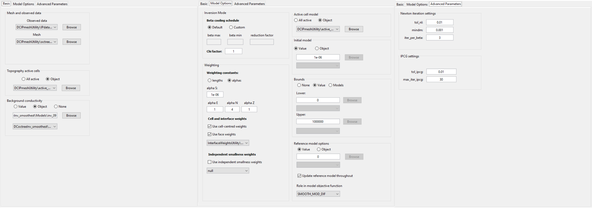
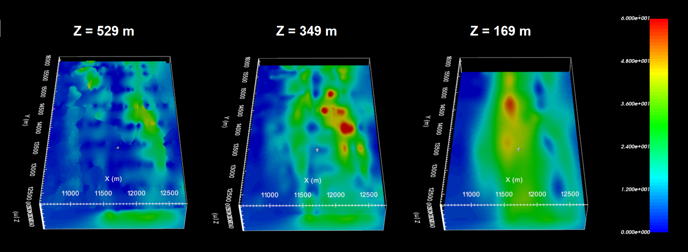
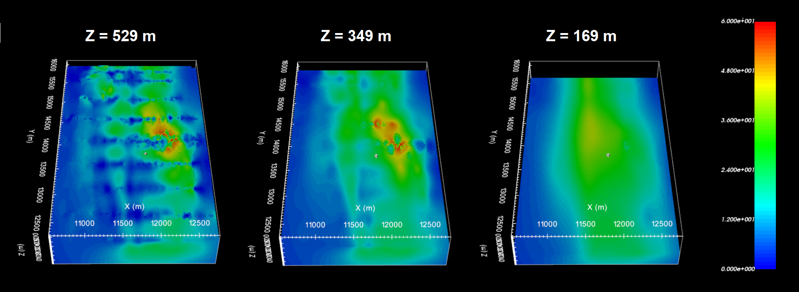
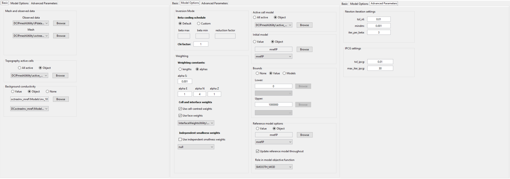
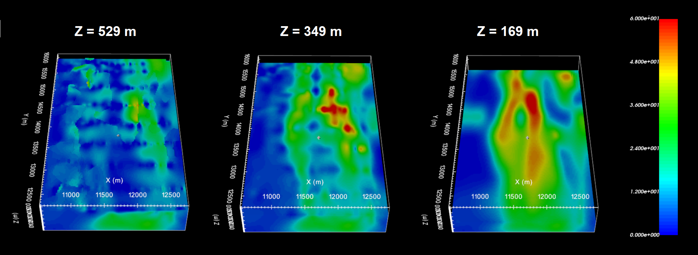

.. _comprehensive_workflow_dcip_13:

.. include:: <isonum.txt>

IP OcTree Inversion using Weights and Reference Models
======================================================

Smoothest Inversion with Near-Surface Interface Weights
-------------------------------------------------------

Discussion of Parameters
^^^^^^^^^^^^^^^^^^^^^^^^

Discussion of Results
^^^^^^^^^^^^^^^^^^^^^

    Recovered model at iteration 3.

Smoothest Inversion with Sensitivity Weights
--------------------------------------------

Discussion of Parameters
^^^^^^^^^^^^^^^^^^^^^^^^

Discussion of Results
^^^^^^^^^^^^^^^^^^^^^

    Recovered model at iteration 2.

Inversion Constrained by Reference Model
----------------------------------------

Discussion of Parameters
^^^^^^^^^^^^^^^^^^^^^^^^

Discussion of Results
^^^^^^^^^^^^^^^^^^^^^

    Recovered model at iteration 3.