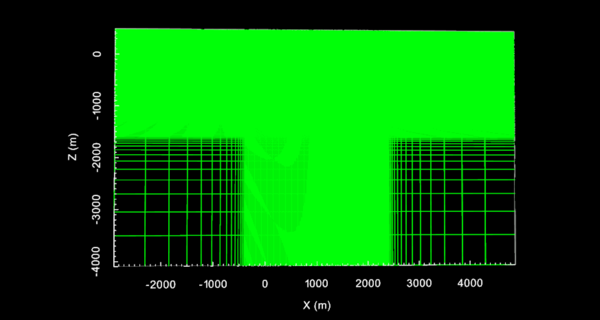
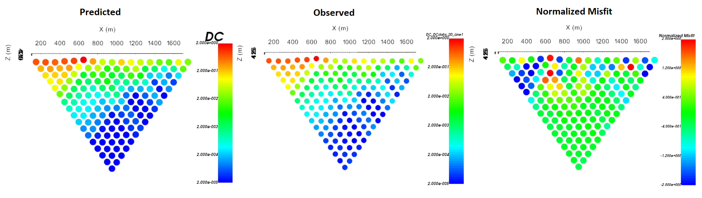
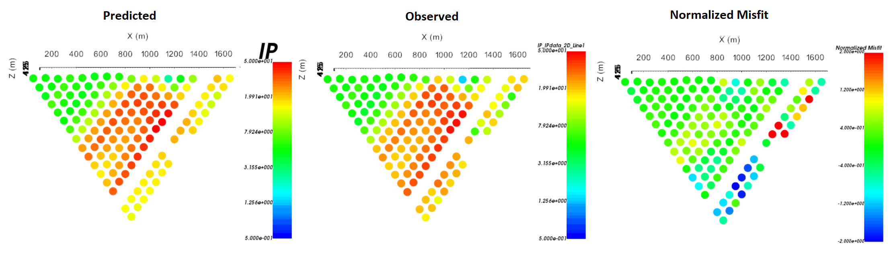
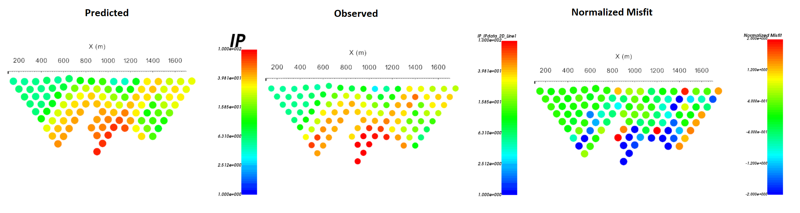
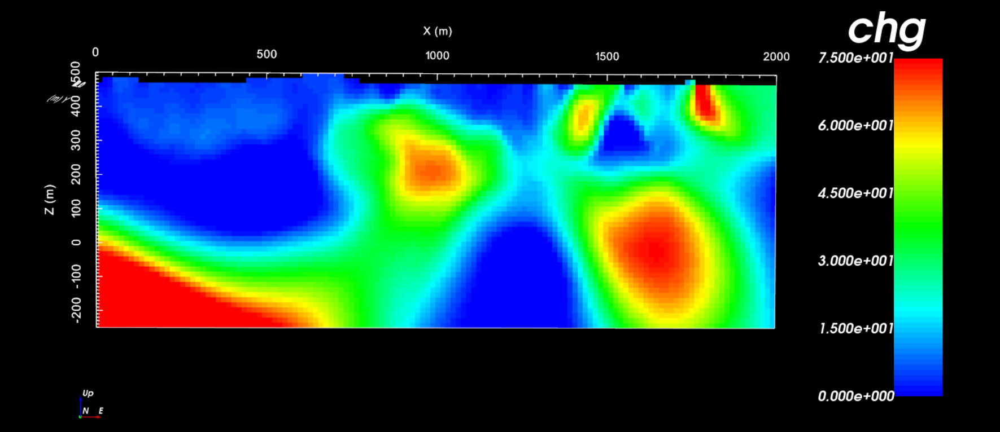

.. _comprehensive_workflow_dcip_3:

.. include:: <isonum.txt>

Independent 2D Inversion
========================

Define Mesh
-----------

longest line is ~2000 m long
largest tx-rx separation is 2000 m

dx = 15, dz = 15
-400 to 2400

height: 400-500
depth below: 1000
all padding: 1000

    2D tensor mesh.

2D DC Inversion
---------------

.. figure:: images/inv_dc2d_line1_convergence.png
    :align: center
    :width: 500

    Convergence.

.. figure:: images/inv_dc2d_line1_dipole_pole.png
    :align: center
    :width: 700

    Data misfit (dipole-pole).

    Data misfit (pole-dipole).

.. figure:: images/inv_dc2d_line1_model12.png
    :align: center
    :width: 500

    Recovered model at iteration 12.

2D IP Inversion
---------------

.. figure:: images/inv_ip2d_line1_convergence.png
    :align: center
    :width: 500

    Convergence.

    Data misfit (dipole-pole).

    Data misfit (pole-dipole).

    Recovered model at iteration 4.

