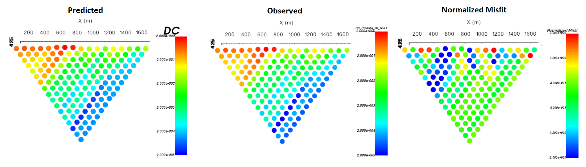

.. _comprehensive_workflow_dcip_5:

.. include:: <isonum.txt>

Analyzing 2D Inversion Results
==============================

To fully comprehend the inversion results we must examine the convergence, the data misfit and the recovered models. Before looking at recovered models, the user is **strongly** urged to examine the convergence of the algorithm first (Tikhonov curve). By examining the convergence, we can:

    - see if the inversion is able to reach target misfit
    - infer whether the target misfit is reasonable; i.e. did we globally over or under-estimate the uncertainties on our data

We then assess how well a given recovered model explains the data by looking at the predicted data, observed data and normalized data misfit maps. From this we can determine whether:

    - the predicted data fits the amplitude, shape and character of observed data structures
    - the estimated uncertainties were balanced and that all data a fit evenly
    - the inversion must be re-run with a new set of uncertainties

Only when the convergence and data misfit are acceptable can we infer geological structures from recovered models.

2D DC Tutorial Data (Line 1)
----------------------------

Convergence
^^^^^^^^^^^

Once the inversion outputs have been loaded (done in the :ref:`inversion section <comprehensive_workflow_dcip_4>` )

    - :ref:`View convergence <convergence_curve>`

The Tikhonov curve for our tutorial inversion is shown below. According to the figure:

    - the inversion reaches a chi-factor of 1.08 after 12 iterations.
    - the data misfit is decreasing over the course of the beta cooling schedule, except for at iteration 13.
    - the inversion is able to reach target misfit (chi-factor = 1)

.. figure:: images/inv_dc2d_line1_convergence.png
    :align: center
    :width: 500

    Tikhonov curve.

Data Misfit
^^^^^^^^^^^

According the Tikhonov curve, the recovered model at iteration 12 has a good chance of explaining the data without fitting the noise if the estimate of our uncertainties is correct. To be sure however, we must examine the observed data, predicted data and data misfit for the corresponding model. Here are some good questions to ask during this step:

    - Are the prominent anomaly features identified in the observed data also found in the predicted data?
    - Are there obvious coherent features in the normalized misfit maps? If so, this indicates you are over-fitting certain regions at the expense of others and that you must assign new uncertainties and re-run the inversion.

For iteration 12, we used the *split data based on electrode geometry* to separate the dipole-pole and pole-dipole data once again. For each electrode configuration, we see the predicted data, observed data and normalized misfit below. For this survey line, we saw that:

    - Data structures in the dipole-pole and pole-dipole data are well reproduced.
    - The dipole-pole and pole-dipole are are fit relatively equally.
    - The normalized misfits generally lie within a range of [-2, 2].
    - The highest normalized misfit values are associated with higher voltage measurements. This could be cause by a) over-estimating the floor uncertainty and/or b) underestimating the percent uncertainty.

Overall we are satisfied with how well iteration 12 reproduces the data so we will continue. If you are not satisfied, it is advised to adjust the uncertainties and re-invert the data.

    Predicted data, oberved data and normalized data misfit (dipole-pole). Predicted data are plotted on the same scale. Normalized misfits are plotted on a colorscale from -2 to 2.

.. figure:: images/inv_dc2d_line1_pole_dipole.png
    :align: center
    :width: 700

    Predicted data, oberved data and normalized data misfit (pole-dipole). Predicted data are plotted on the same scale. Normalized misfits are plotted on a colorscale from -2 to 2.

Recovered Conductivity Model
^^^^^^^^^^^^^^^^^^^^^^^^^^^^

The conductivity model recovered at the 12th iteration is shown below. According to the recovered model:

    - The range of recovered conductivity values spans many orders of magnitude.
    - There is an extremely conductive structure near *X* = 1500 m and a secondary conductive structure at *X* = 950 m.
    - There is a very resistive structure East of *X* = 700 m.

.. figure:: images/inv_dc2d_line1_model12.png
    :align: center
    :width: 500

    Recovered model at iteration 12.

2D IP Tutorial Data (Line 1)
----------------------------

Once the inversion outputs have been loaded (done in the :ref:`inversion section <comprehensive_workflow_dcip_4>` )

    - :ref:`View convergence <convergence_curve>`

The Tikhonov curve for our tutorial inversion is shown below. According to the figure:

    - the Tikhonov curve begins to flatten significantly after iteration 4 (chi-factor = 1.6). This indicates we may have under-estimated our uncertainties.
    - the data misfit is decreasing over the course of the beta cooling schedule.
    - the inversion is able to reach target misfit between iterations 5 and 6 (chi-factor = 1)

.. figure:: images/inv_ip2d_line1_convergence.png
    :align: center
    :width: 500

    Tikhonov curve.

Data Misfit
^^^^^^^^^^^

According the Tikhonov curve, the recovered model at iteration 4 has a good chance of explaining the data without fitting the noise. This is assuming we have slightly under-estimated the uncertainties on our data. To be sure however, we must examine the observed data, predicted data and data misfit for the corresponding model. Here are some good questions to ask during this step:

    - Are the prominent anomaly features identified in the observed data also found in the predicted data?
    - Are there obvious coherent features in the normalized misfit maps? If so, this indicates you are over-fitting certain regions at the expense of others and that you must assign new uncertainties and re-run the inversion.

For iteration 4, we used the *split data based on electrode geometry* to separate the dipole-pole and pole-dipole data once again. For each electrode configuration, we see the predicted data, observed data and normalized misfit below. For this survey line, we saw that:

    - Data structures in the dipole-pole and pole-dipole data are reasonably well reproduced. However, the predicted pole-dipole IP anomaly has a smaller amplitude than was observed. 
    - The dipole-pole data appear slightly over-fit while the pole-dipole data are slightly under-fit.
    - The balance between floor and percent uncertainty seems reasonable as we are fitting the anomalies and not the background.

For this exercise, we will not assign new uncertainties and re-run the inversion. In practice however, you may choose to decrease the percent uncertainty on the pole-dipole data.

.. figure:: images/inv_ip2d_line1_dipole_pole.png
    :align: center
    :width: 700

    Predicted data, oberved data and normalized data misfit (dipole-pole). Predicted data are plotted on the same scale. Normalized misfits are plotted on a colorscale from -2 to 2.

.. figure:: images/inv_ip2d_line1_pole_dipole.png
    :align: center
    :width: 700

    Predicted data, oberved data and normalized data misfit (pole-dipole). Predicted data are plotted on the same scale. Normalized misfits are plotted on a colorscale from -2 to 2.

Recovered Conductivity Model
^^^^^^^^^^^^^^^^^^^^^^^^^^^^

The chargeability model recovered at the 4th iteration is shown below. According to the recovered model:

    - The maximum chargeability value is 61 ms, which is less than the largest apparent chargeability seen in the pole-dipole data. The model at iteration 5 has a larger maximum chargeability. However, the structures in this model were less geologically plausible.
    - The secondary conductive structure at *X* = 950 m appears to be chargeable.

.. figure:: images/inv_ip2d_line1_model4.png
    :align: center
    :width: 500

    Recovered model at iteration 4.

