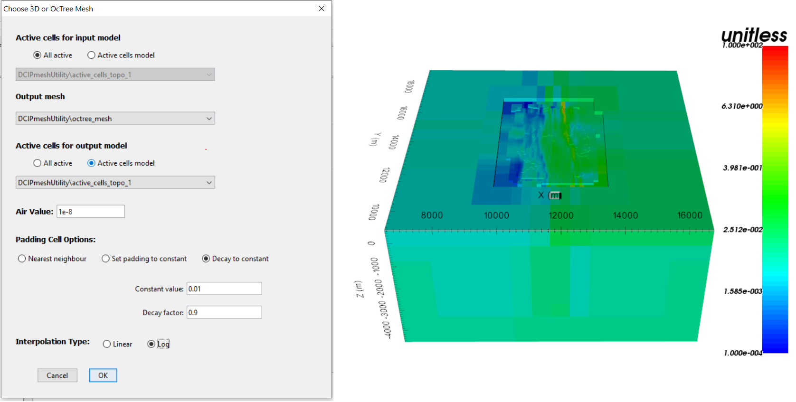

.. _comprehensive_workflow_dcip_8:

.. include:: <isonum.txt>

Weights and Models for DC Inversion
===================================

In this section we demonstrate how to:

	- Create a starting/reference model from the batch 2D inversion result
	- Create near-surface interface weights
	- Create sensitivity weights for the DC inversion

Starting/Reference Model from Batch 2D Inversion
------------------------------------------------

In the :ref:`2D batch inversion <omprehensive_workflow_dcip_6>` section, we generated a 3D conductivity model by interpolating the set of 2D slices. If we have confidence in the structures recovered from the batch 2D inversion, we may want to use it as a starting/reference model. To do this, we must interpolate the 3D tensore model onto the :ref:`OcTree mesh we generated in the previous section <comprehensive_workflow_dcip_7>` . To accomplish this, we use:

	- :ref:`Interpolate with nearest neighbour <objectFunctionalityNearest3D>`

**For the tutorial data** , the parameters used and the OcTree model are shown below.

    Interpolation parameters and reference/starting conductivity model on OcTree mesh for tutorial data.

Near-Surface Interface Weighting
--------------------------------

When inverting DC data, the code has a tendency to place conductive structures near electrode locations due to the sensitivity of the data to those locations. One way to counteract this problem is to generate interface weights. By forcing lateral smoothness within the top few layers of cells, we can limit the artifacts and force the inversion to place conductive structures at the appropriate depths.

    - :ref:`Create and interface weights utility <createinterfWeights>`
    - Use :ref:`edit options <utilEditOptions>` and set the following parameters:

        - set the OcTree mesh
        - set as *log model*
        - set topography as the active cells model
        - set number of layers and corresponding weights (choose something exponentially decreasing. We chose 10, and 4)
        - Face value = 1 (only matters for non-homogeneous backgrgound model)
        - Face tolerance = 1 (only matters for non-homogeneous backgrgound model)

    - :ref:`Run the utility <utilRun>`
    - :ref:`Load results <utilLoadResults>`

Sensitivity Weighting for DC Inversion
--------------------------------------

To counteract issues related to the sensitivity of the data with respect to cells near electrodes, you may choose to implement sensitivity weighting. To create a cell weights model for the DC inversion, do the following:

    - :ref:`Create and interface weights utility <createinterfWeights>`
    - Use :ref:`edit options <utilEditOptions>` and set the following parameters:

        - set the OcTree mesh
        - set as *log model*
        - set topography as the active cells model
        - set number of layers and corresponding weights (choose something exponentially decreasing. We chose 10, and 4)
        - Face value = 1
        - Face tolerance = 1

    - :ref:`Run the utility <utilRun>`
    - :ref:`Load results <utilLoadResults>`

