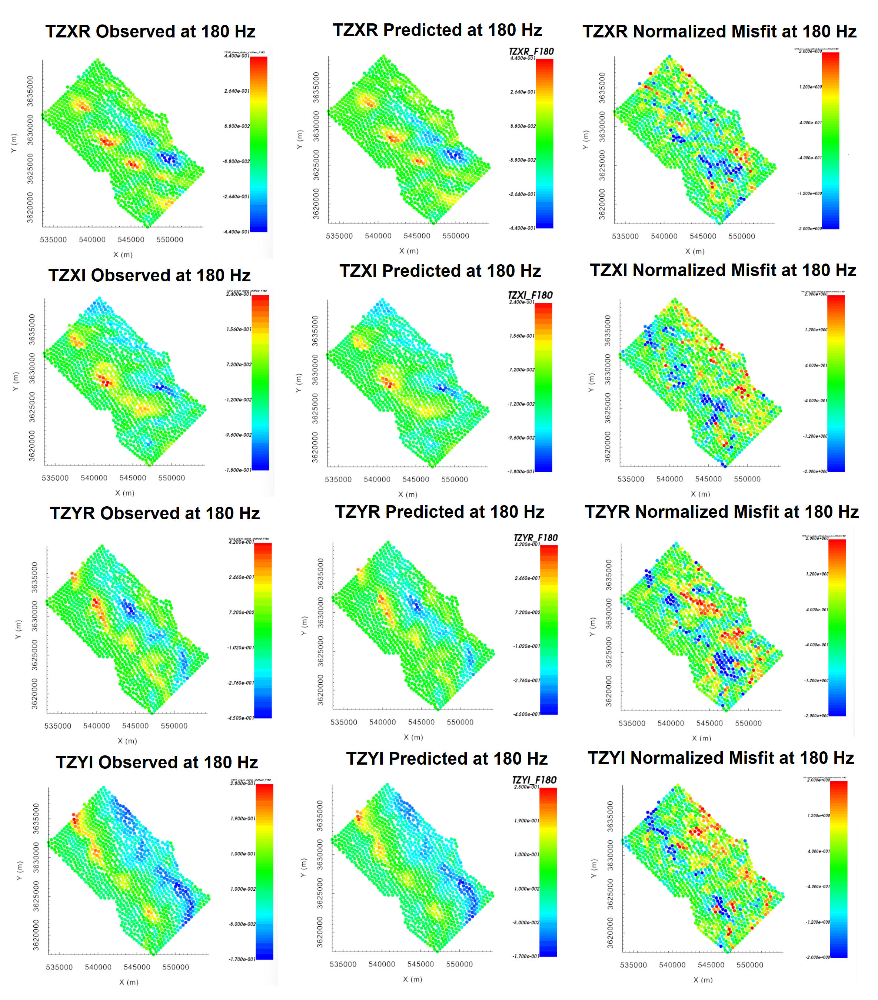
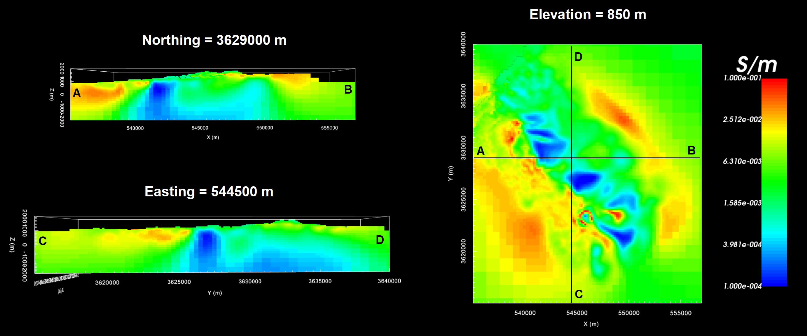

.. _comprehensive_workflow_mt_ztem_6:

Independent ZTEM Inversion
==========================

For independent ZTEM inversion, a standard approach for mesh design, creating interface weights, setting up and running the inversion, and analyzing the results was covered in the Dufferin Lake comprehensive workflow. We strongly urge the reader to be familiar with this material, as we will take the same approach here. For reference, visit:

    - :ref:`Designing an OcTree mesh <comprehensive_workflow_ztem_5>`

    - :ref:`Interface weights, setting up and running the inversion <comprehensive_workflow_ztem_6>`

    - :ref:`Analyzing inversion results <comprehensive_workflow_ztem_7>`

Mesh Design
-----------

According to the apparent resistivity maps and sounding curves, the Earth is more conductive near the surface and more resistive at depth. Over the range of frequencies at which we are inverting ZTEM data (30 - 720 Hz), the apparent resistivities are generally between 100 - 1000 :math:`\Omega m`. For a background resisitivity of 500 :math:`\Omega m`:

	- :math:`\delta_{min}` = 417 m
	- :math:`\delta_{max}` = 2041 m

Here, we create an OcTree mesh using the E3DMT v2 utility. The steps are as follows:

    - :ref:`create OcTree mesh with E3DMT v2 utilities <createE3DMTv2octreeMesh>`

Once you have created the object, complete the following steps:

	1) Set the data object corresponding to the survey
	2) Define the mesh using *Edit Options*
	3) Run the utility
	4) Load results

For the field data provided, the following parameters we set in *Edit Options*.

.. figure:: images/mesh_parameters_ztem.png
    :align: center
    :width: 500

Interface Weights
-----------------

Interface weights were generated to enforce lateral smoothness within the top few layers. For the tutorial MT data, we did the following:

    - :ref:`Create and interface weights utility <createinterfWeights>`
    - Use :ref:`edit options <utilEditOptions>` and set the following parameters:

        - set the OcTree mesh
        - set as *log model*
        - set topography as the active cells model
        - set number of layers and corresponding weights (choose something exponentially decreasing. We chose 10 and 5)
        - Face value = 0.01
        - Face tolerance = 0.01

    - :ref:`Run the utility <utilRun>`
    - :ref:`Load results <utilLoadResults>`

Setup and Run Inversion
-----------------------

The ZTEM inversion was carried out using E3DMT v2. There steps were as follows: 

    - :ref:`Create E3DMT v2 inversion object <createMTZTEMInv>`
    - Use edit options for :ref:`v2 <invEditOptions_e3dmt_ver2>` to set the inversion parameters
    - Click *Apply and write files*
    - :ref:`Run the inversion <invRun>`

For the tutorial dataset provided, the parameters used to invert the data are shown below.

    Parameters used to invert the field dataset using E3DMT v2.

Analysis of Results
-------------------

Convergence
^^^^^^^^^^^

Once the inversion has finished:

    - :ref:`View convergence <convergence_curve>`

The Tikhonov curve for our tutorial inversion is shown below. According to the figure:

    - the total misfit (not data misfit) reached the target (chi-factor of 0.5) at the 10th iteration, which caused the program to finish.
    - the Tikhonov curve starts to flatten out around somewhere between the 5th and 7th interations.
    - Subsequent analysis of iterations 5-7 showed that later iterations did not fit the data significantly better and that compact conductive structures in the recovered models started to show pixelation (over-fitting) in iterations 6 and 7.
    - Here, we believe **iteration 5** best explains the data globally without overfitting.
    - The **data misfit** at 5th iteration corresponds to a chi factor of 0.5. Therefore, we have likely over-estimated the global level of uncertainty on our data. If estimated correctly, we would expect the convergence curve to flatten our near a chi-factor of 1.

.. figure:: images/convergence_ztem_002.PNG
    :align: center
    :width: 700

Data Misfit
^^^^^^^^^^^

Now that we have selected an iteration (or range of iterations) that we feel explains the data without overfitting:

    - :ref:`Load inversion results for these iterations <invLoadResults>`

According the Tikhonov curve, the recovered model at iteration 5 has a good change of explaining the data without fitting the noise. For our example inversion, here are some things we noticed:

    - The general shape and amplitude of the main geophysical signatures are well reproduced by the predicted data at all frequencies and for all components.
    - The range of normalized misfits are generally consistent over all frequencies and over all components. This indicates that our basic estimate of the data uncertainties was a good first estimate.
    - Higher normalized misfits were observed at the lowest (30 Hz) and highest (720) frequencies, especially in the quadrature data.
    - Individual misfit maps shown coherent features, but these features are not consistent over all frequencies.
    

For our example, better results could be obtained by decreasing the floor uncertainty on the quadrature data by some factor and re-running the inversion to ensure we recover a model which fits the data evenly. To fit the highest and lowest frequencies better, we may lower the uncertainties. However, it is possible that our mesh was not designed to model these frequencies with a high enough level of accuracy.

    Predicted data, observed data and normalized misfit for all data components at 180 Hz. For each component, predicted and observe data are plotted on the same scale. All normalized misfit maps are plotted on a range from -2 to 2.

Recovered Model
^^^^^^^^^^^^^^^

The conductivity model recovered at the  5th iteration is shown below. The colormap was scaled to 1e-4 S/m to 0.25 S/m. According to the recovered model:

    - A large-scale resistive feature between two more conductive regional features trends from Northwest to Southeast. This is consistent with our original interpretation of the ZTEM data using total divergence maps.
    - Within the resistive feature are localized regions of higher conductivity. However, these conductive features are not as strongly visible as in the MT inversion results.

    Recovered model at iteration 5.