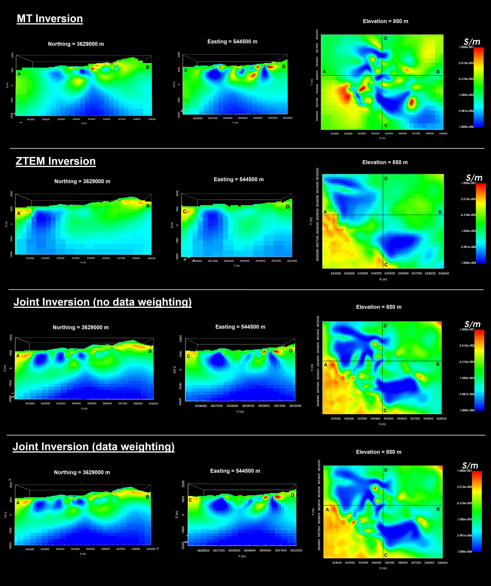

.. _comprehensive_workflow_mt_ztem_8:

Performing Joint Inversion
==========================

Here, we provide the steps for setting up and running a joint MT-ZTEM inversion with E3DMT v2. By now, we assume the process of setting up and choosing reasonable inversion parameters is well-understood; see the :ref:`Cloncurry MT comprehensive workflow <comprehensive_workflow_mt_6>` and :ref:`Dufferin lake ZTEM comprehensive workflow <comprehensive_workflow_mt_6>`. Here, we will focus on weighting that can be applied to each dataset in the joint inversion and how it impact the final inversion result.

Inversion With No Data Weighting
--------------------------------

In this case, we assume that our uncertainties are balanced and that we want to fit each dataset in the joint inversion equally.

Setup and Run Inversion
^^^^^^^^^^^^^^^^^^^^^^^

The joint MT-ZTEM inversion was carried out using E3DMT v2. There steps were as follows: 

    - :ref:`Create E3DMT v2 inversion object <createMTZTEMInv>`
    - Use edit options for :ref:`v2 <invEditOptions_e3dmt_ver2>` to set the inversion parameters
    - Click *Apply and write files*
    - :ref:`Run the inversion <invRun>`

For the tutorial dataset provided, the parameters used to invert the data are shown below.

.. figure:: images/inv_parameters_joint.png
    :align: center
    :width: 700

    Parameters used to invert the field dataset using E3DMT v2.

**Discussion of Parameters:**

    - Background, starting and reference models of 0.002 S/m were set. This corresponds to a rough average value of the apparent resistivity sounding curves over the frequencies we are inverting. It also seemed to work well for the more localized MT inversion.
    - The starting beta was chosen as a result of preliminary inversion attempts.
    - The inversion code will terminate when the total misfit (not data misfit) reaches the target chi-factor. We chose 0.4 to guarantee we will have some over-fitting iterations, even if we globally over-estimate our uncertainties.
    - We chose to invert for the smoothest model, which recovers a data driven result that does not depend on the reference model. We do this by setting *alpha S* to a very small value.

Convergence
^^^^^^^^^^^

Once the inversion has finished:

    - :ref:`View convergence <convergence_curve>`

The Tikhonov curve for our tutorial inversion is shown below. According to the figure:

    - the inversion code did not reach target misfit before the maximum number of allowable iterations (i.e. 10).
    - the Tikhonov curve starts to become less steep after the 5th iteration, but does not flatten out. At each subsequent iteration, the misfit appears to be steadily decreasing. At this point, any iteration greater than or equal to 5 is candidate for further analysis.
    - we looked at the largest conductivity values for the recovered models after iteration 5. We noticed that after iteration 7, the maximum conductivity in the recovered models became excessively large and kept increasing with each iteration.
    - as a result, our model is likely within iterations 5-7. 
    - the **data misfit** at 5th iteration corresponds to a chi factor of 0.56. Therefore, we have likely over-estimated the global level of uncertainty on our data. If estimated correctly, we would expect the convergence curve to flatten our near a chi-factor of 1.

.. figure:: images/convergence_joint_002.PNG
    :align: center
    :width: 700

Data Misfit
^^^^^^^^^^^

Now that we have selected an iteration (or range of iterations) that we feel explains the data without overfitting:

    - :ref:`Load inversion results for these iterations <invLoadResults>`

According the Tikhonov curve, a recovered model within iterations 5-7 has a good change of explaining the data without fitting the noise. Here, we will examine **iteration 5**. For the example inversion, here are some things we noticed:

    - the range of normalized misfits are generally consistent over all frequencies and over all components. This indicates that we are generally not drastically over-fitting certain components/frequencies at the expense of others.
    - higher normalized misfits were observed at the lowest (30 Hz) and highest (720) frequencies. For the 720 Hz data this makes sense, as the uncertainties applied we larger relative to the maximum amplitude. This was a deliberate choice given that 720 Hz data are usually poorer in quality.
    - the general shape of the main geophysical signatures are well reproduced by the predicted data at all frequencies and for all components. However, the amplitude for some features are underestimated. This indicates we are overfitting the background at the expense of fitting the anomalies. Although the amplitude was better reproduced at iterations 6 and 7, correlated features in the misfit maps remained.

    Predicted data, observed data and normalized misfit for all data components at 180 Hz. For each component, predicted and observe data are plotted on the same scale. All normalized misfit maps are plotted on a range from -2 to 2.

For our example, better results could be obtained by considering the following:

    1. to ensure we fit ZTEM anomalies and not the background, we can 
    spatially selected data at each frequency and for each component, assign a reduced uncertainty to those data, then re-run the inversion. The steps for modifying the uncertainties this way were explained in the :ref:`Raglan magnetics comprehensive workflow <comprehensive_workflow_magnetics_3_better_fit>`.

    2. in order to run the inversion on a single 64 GB node, the smallest cell size was only 0.4 times the minimum skin depth. This is likely too coarse to model the highest frequencies with sufficient accuracy and would explain why the convergence became slower after iteration 5 but did not flatten.

Recovered Model
^^^^^^^^^^^^^^^

The conductivity model recovered at the 5th iteration is shown below. The colormap was scaled to 1e-4 S/m to 0.1 S/m. According to the recovered model:

    - a large-scale resistive feature is located between two more conductive regional features which trend from Northwest to Southeast. This is consistent with our original interpretation of the ZTEM data using total divergence maps.
    - Within the resistive feature are localized regions of higher conductivity. However, these conductive features are not as strongly visible as in the MT inversion results.

    Recovered model from ZTEM data at iteration 5.

Inversion With Data Weighting
-----------------------------

Setup and Run Inversion
^^^^^^^^^^^^^^^^^^^^^^^

The joint MT-ZTEM inversion was carried out using E3DMT v2. There steps were as follows: 

    - :ref:`Create E3DMT v2 inversion object <createMTZTEMInv>`
    - Use edit options for :ref:`v2 <invEditOptions_e3dmt_ver2>` to set the inversion parameters
    - Click *Apply and write files*
    - :ref:`Run the inversion <invRun>`

For the tutorial dataset provided, the parameters used to invert the data are shown below.

.. figure:: images/inv_parameters_joint.png
    :align: center
    :width: 700

    Parameters used to invert the field dataset using E3DMT v2.

**Discussion of Parameters:**

    - Background, starting and reference models of 0.002 S/m were set. This corresponds to a rough average value of the apparent resistivity sounding curves over the frequencies we are inverting. It also seemed to work well for the more localized MT inversion.
    - The starting beta was chosen as a result of preliminary inversion attempts.
    - The inversion code will terminate when the total misfit (not data misfit) reaches the target chi-factor. We chose 0.4 to guarantee we will have some over-fitting iterations, even if we globally over-estimate our uncertainties.
    - We chose to invert for the smoothest model, which recovers a data driven result that does not depend on the reference model. We do this by setting *alpha S* to a very small value.

Convergence
^^^^^^^^^^^

Once the inversion has finished:

    - :ref:`View convergence <convergence_curve>`

The Tikhonov curve for our tutorial inversion is shown below. According to the figure:

    - the inversion code did not reach target misfit before the maximum number of allowable iterations (i.e. 10).
    - the Tikhonov curve starts to become less steep after the 5th iteration, but does not flatten out. At each subsequent iteration, the misfit appears to be steadily decreasing. At this point, any iteration greater than or equal to 5 is candidate for further analysis.
    - we looked at the largest conductivity values for the recovered models after iteration 5. We noticed that after iteration 7, the maximum conductivity in the recovered models became excessively large and kept increasing with each iteration.
    - as a result, our model is likely within iterations 5-7. 
    - the **data misfit** at 5th iteration corresponds to a chi factor of 0.56. Therefore, we have likely over-estimated the global level of uncertainty on our data. If estimated correctly, we would expect the convergence curve to flatten our near a chi-factor of 1.

.. figure:: images/convergence_joint_002_dweighted.PNG
    :align: center
    :width: 700

Data Misfit
^^^^^^^^^^^

Now that we have selected an iteration (or range of iterations) that we feel explains the data without overfitting:

    - :ref:`Load inversion results for these iterations <invLoadResults>`

According the Tikhonov curve, a recovered model within iterations 5-7 has a good change of explaining the data without fitting the noise. Here, we will examine **iteration 5**. For the example inversion, here are some things we noticed:

    - the range of normalized misfits are generally consistent over all frequencies and over all components. This indicates that we are generally not drastically over-fitting certain components/frequencies at the expense of others.
    - higher normalized misfits were observed at the lowest (30 Hz) and highest (720) frequencies. For the 720 Hz data this makes sense, as the uncertainties applied we larger relative to the maximum amplitude. This was a deliberate choice given that 720 Hz data are usually poorer in quality.
    - the general shape of the main geophysical signatures are well reproduced by the predicted data at all frequencies and for all components. However, the amplitude for some features are underestimated. This indicates we are overfitting the background at the expense of fitting the anomalies. Although the amplitude was better reproduced at iterations 6 and 7, correlated features in the misfit maps remained.

    Predicted data, observed data and normalized misfit for all data components at 180 Hz. For each component, predicted and observe data are plotted on the same scale. All normalized misfit maps are plotted on a range from -2 to 2.

For our example, better results could be obtained by considering the following:

    1. to ensure we fit ZTEM anomalies and not the background, we can spatially selected data at each frequency and for each component, assign a reduced uncertainty to those data, then re-run the inversion. The steps for modifying the uncertainties this way were explained in the :ref:`Raglan magnetics comprehensive workflow <comprehensive_workflow_magnetics_3_better_fit>`.

    2. in order to run the inversion on a single 64 GB node, the smallest cell size was only 0.4 times the minimum skin depth. This is likely too coarse to model the highest frequencies with sufficient accuracy and would explain why the convergence became slower after iteration 5 but did not flatten.

Recovered Model
^^^^^^^^^^^^^^^

The conductivity model recovered at the 5th iteration is shown below. The colormap was scaled to 1e-4 S/m to 0.1 S/m. According to the recovered model:

    - a large-scale resistive feature is located between two more conductive regional features which trend from Northwest to Southeast. This is consistent with our original interpretation of the ZTEM data using total divergence maps.
    - Within the resistive feature are localized regions of higher conductivity. However, these conductive features are not as strongly visible as in the MT inversion results.

    Recovered model from ZTEM data at iteration 5.

Comparison of All Inversions
----------------------------

