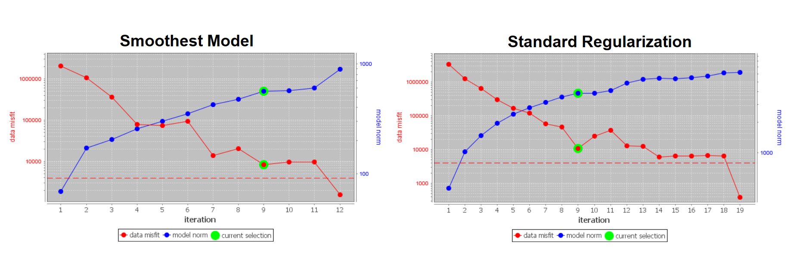
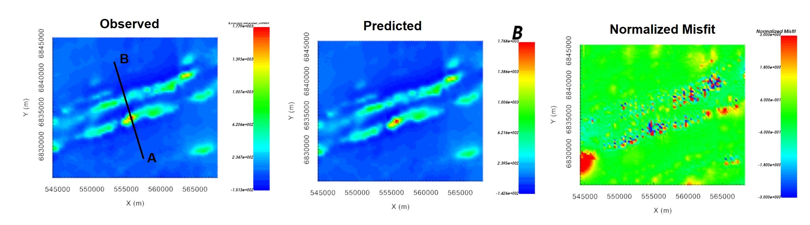
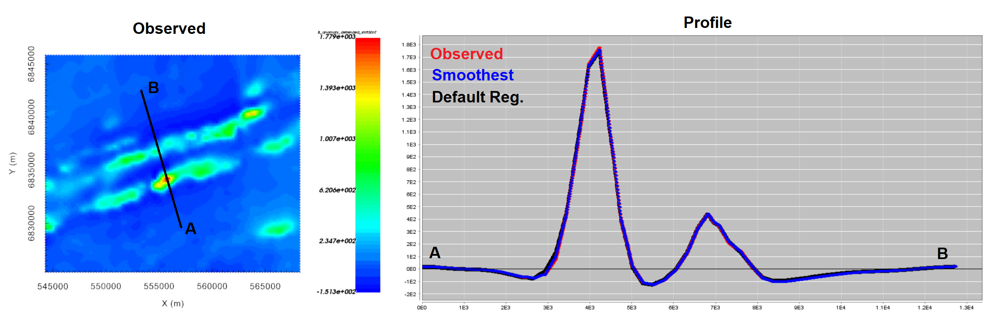
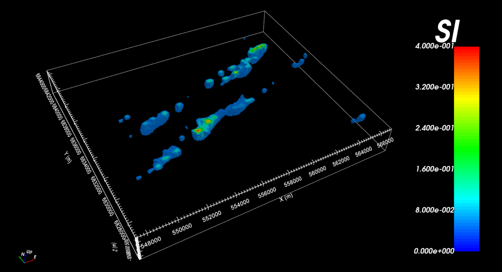
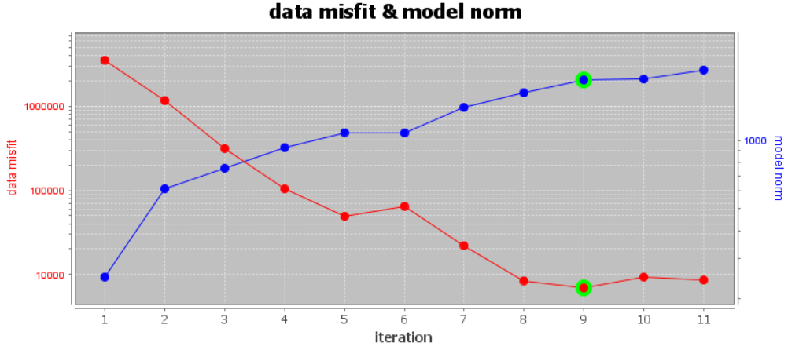
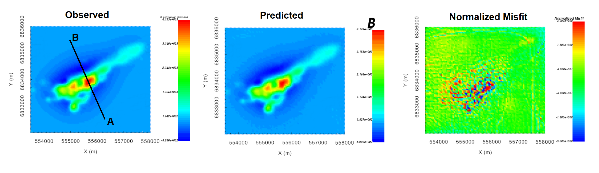
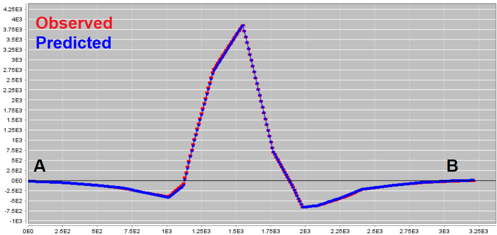
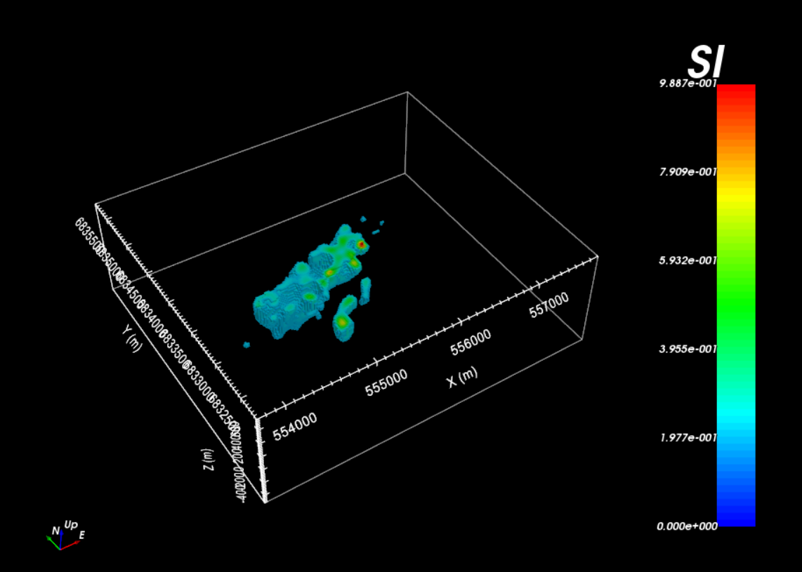

.. _comprehensive_workflow_magnetics_10:

.. include:: <isonum.txt>

Examining Inversion Outputs
===========================

Regional Inversion
------------------

Convergence
^^^^^^^^^^^

Data Misfit
^^^^^^^^^^^

Recovered Model
^^^^^^^^^^^^^^^

Local Inversion (Polynomial Detrended)
--------------------------------------

Convergence
^^^^^^^^^^^

Data Misfit
^^^^^^^^^^^

Recovered Model
^^^^^^^^^^^^^^^

