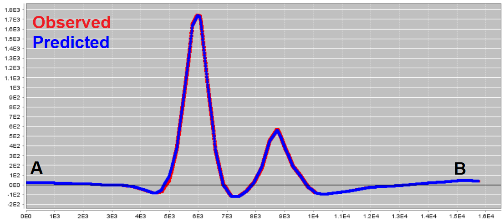
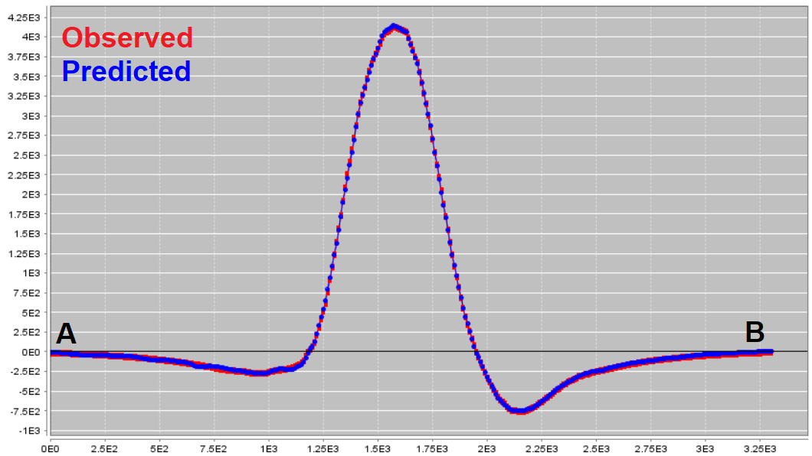

.. _comprehensive_workflow_magnetics_10:

.. include:: <isonum.txt>

Examining Inversion Outputs
===========================

Regional Inversion
------------------

Convergence
^^^^^^^^^^^

.. figure:: images/inv_regional_convergence.png
    :align: center
    :width: 700

Data Misfit
^^^^^^^^^^^

.. figure:: images/inv_regional_misfit.png
    :align: center
    :width: 700

Recovered Model
^^^^^^^^^^^^^^^

Local Inversion (Polynomial Detrended)
--------------------------------------

Convergence
^^^^^^^^^^^

.. figure:: images/inv_local_convergence.png
    :align: center
    :width: 700

Data Misfit
^^^^^^^^^^^

.. figure:: images/inv_local_misfit.png
    :align: center
    :width: 700

Recovered Model
^^^^^^^^^^^^^^^

.. figure:: images/inv_local_model.png
    :align: center
    :width: 700