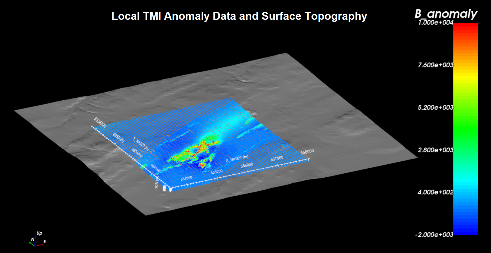

.. _comprehensive_workflow_magnetics_2:

.. include:: <isonum.txt>

Loading TMI Data and Cursory Interpretation
===========================================

The first step in any project is to load field collected data and visualize it. Here, we will assume the data are in XYZ-formatted files. However, data can be loaded directly if they are in `UBC-GIF format <https://giftoolscookbook.readthedocs.io/en/latest/content/fileFormats/magfile.html>`__. Here, we load the TMI data, remove the background magnetic field and visualize the anomaly data.

**The tutorial data consists of both local and regional datasets**. The local scale dataset encompasses our region of interest. It consists of many lines of surface TMI data collected using a skidoo. If available, coarse regional magnetic data can be used to better understand regional-scale magnetic anomalies and constrain local inversion results. 

.. important:: Requires GIFtools v2.34 or later.

Starting Your Project
---------------------

    - Open GIFtools
    - :ref:`Set the working directory <projSetWorkDir>`

Import Files
------------

Here, we import the TMI data and topography data. **The tutorial data are in a general XYZ format but the same functionality is available for CSV or UBC-GIF formatted data**. To import the data and topography:

    - :ref:`Import topography data (XYZ format) <importTopo>`
    - :ref:`Import magnetic (TMI) data <importMagData>`

Defining Earth's Inducing Field
-------------------------------

.. note:: If the data file is UBC-GIF format, the file contains the properties for defining the Earth's field. And these properties are automatically assign upon loading the data file.

In this step, we define the inclination, declination and intensity of the Earth's magnetic field for the local survey site. There are several ways to obtain this information:

    - It is provided within the magnetic data file
    - The historical `international geomagnetic reference field <//en.wikipedia.org/wiki/International_Geomagnetic_Reference_Field>`__ for the survey location on the survey date is obtained using online resources
    - The data file contains columns defining the inclination, declination and field intensity for each survey point.

So long as the size of the survey region is reasonable, we assume the properties of the Earth's field are constant throughout the region. To assign the inclination, declination and intensity:

    - If inclination, declination and intensity columns are provided, :ref:`view statistics <viewData_statistics>` and determine the average values.
    - :ref:`Assign the field parameters <objectEditFieldParam>`

**For the local tutorial data**, we were provided with inclination, declination and field intensity columns. Using *view statistics* and taking the mean values, we obtained:

    - *intensity* = 58266 nT
    - *inclination* = 81.26 deg
    - *declination* = -28.44 deg

**Regional tutorial data supplied by NRCan** were processed and provided such that the anomaly corresponds to a survey carried out June 5th, 2020. This dataset also assumes a constant flight height of 305 m (elevation ~900 m). Using historical IGRF data from the `National Centers for Environmental Information <https://www.ngdc.noaa.gov/geomag/calculators/magcalc.shtml#igrfwmm>`__ , we obtained the following properties for the Earth's field at the regional scale:

    - *intensity* = 57363 nT
    - *inclination* = 80.24 deg
    - *declination* = -22.35 deg

.. note:: During the time between the collection of the local and regional datasets, the Earth's field may have change significantly. The impact this has on necessary processing is discussed later in the tutorial. 

Removing the Background Field
-----------------------------

The background field may be defined by as base station measurements (which contain regional signals) or as the Earth's inducing field (which does not). We must remove the background field from total field measurements in order to obtain the magnetic anomaly data. There are two ways in which this can be done using GIFtools:

    - If the background field (base station or IGRF) is provided in a column, the :ref:`column calculator <objectCalculator>` can be used to subtract the background field from the total field.
    - Or use :ref:`remove IGRF <objectRemoveIGRF>` to subtract the inducing field defined in the previous step of the tutorial.

**For the local tutorial data**, we subtracted the Earth's field from the total field using the column calculator. As such, regional and local information are contained within the resulting data column.

**For the regional tutorial data**, the background field had already been removed and this step was not necessary.

Cursory Interpretation
----------------------

- To view the data, you may select any data object and :ref:`plot with VTK <viewData>`

**Local tutorial data:**

The topography and TMI anomaly are shown below. The topography ranges from an elevation of 540 m to 670 m. The tutorial data were were collected at the surface. In this case, several extremely high amplitude signals were measured and the range of the color scale needed to be fixed between -2000 nT and 10000 nT. The general anomalies features observed in the data map appear to be trending from WSW to ENE. And a large anomalous structure is seen near the middle of the data map.

    

**Regional tutorial data:**

The topography, TMI anomaly data and coverage of the local survey data are plotted below. The WSW to ENE trending features in the local data is consistent with regional features. The background anomaly values observed in the local data are in fact associated with the 'lows' produced by larger scale features. And the regional data itself appears to be in the 'low' produced by even larger period signals; i.e. regional background values are negative. 

    

