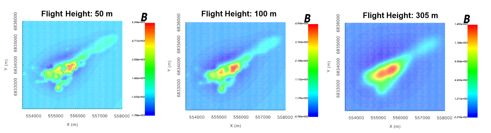

.. _comprehensive_workflow_magnetics_4:

.. include:: <isonum.txt>

Upward Continuation and Reduction to Pole
=========================================

Here, we show how an equivalent source model can be used to compute the expected magnetic anomalies for other locations/field orientations. Some examples include:

    - computing the magnetic anomaly data for a vertical inducing field (reduction to pole)
    - computing the magnetic anomaly data at a higher elevation (upward continuation)
    - computing amplitude data from TMI data or visa versa

**For the local tutorial data**, an equivalent source model was recovered in the previous section. And here, we upward continue the local data to in order to remove problematic high-frequency signals. For the regional data, we will not need to carry out an equivalent source inversion.

Gridding (Optional)
-------------------

Survey lines are not perfectly straight and station spacings not necessarily uniform. If desired, the user can upward continue or perform the reduction to pole such that the result is defined on a set of uniformly gridded points. One thing to bear in mind is that you **cannot** use this gridding technique to interpolate to a finer horizontal spacing. The highest spatial frequency contained in the data are limited by the station and line spacing. So when creating the set of gridded points, the same line spacing and station spacing used in the equivalent source inversion should be used. To create a gridded survey object for upward continuation or reduction to pole:

    - Use the :ref:`create magnetic survey <createSurveySimple>` utility to define a gridded survey at the desired height above the surface topography
    - Use :ref:`assign the field parameters <objectEditFieldParam>` to define the desired inducing field (e.g. vertical for reduction to pole)

**For the local tutorial data:** the minimum line spacing for the original magnetic data was 50 m. And prior to equivalent source inversion, the local magnetic data were downsampled to have a minimum spacing of 25. As a result, a uniform grid with a line spacing of 50 m and a station spacing of 25 m was created. The bearing for the survey lines was 0 degrees (Northing). The origin, line length and number of survey lines were determined by the orignal magnetic data object. We aren't sure what the ideal heigh for upward continuation was, so we created gridded data objects at several heights (50 m, 100 m and 305 m) above surface topography).

.. important:: In order to compare and level the local and regional magnetic data, we are upward continuing the local data using the regional data's inducing field. We are also upward continuing to the same height (305 m).

Upward Continuation/Reduction to Pole
-------------------------------------

.. note:: If you want to preserve the horizontal locations, simply make a copy of the original data object and alter the elevation column/define a different inducing field.

To carry out the upward continuation or reduction to pole:

    - :ref:`Create forward modeling object <createMag3D>`
    - Use :ref:`edit options <fwdEditOptions_Mag3D>` to define the following properties

        - The mesh and equivalent source model
        - The survey 
        - The lower bound is left blank!!!

    - Write the files
    - Run the forward model
    - Load the results when complete
    - *For upward continuation,* undo the DC shift that was applied prior to the equivalent source inversion.

**For the local tutorial data,** upward continued data at elevations of 50 m, 100 m and 305 m are shown below. As expected the magnetic anomaly is broader, smoother and lower peak amplitude at higher elevations. Note that we have NOT YET removed the 375 nT shift that was applied prior to equivalent source inversion; which is why the background is ~0 nT.

