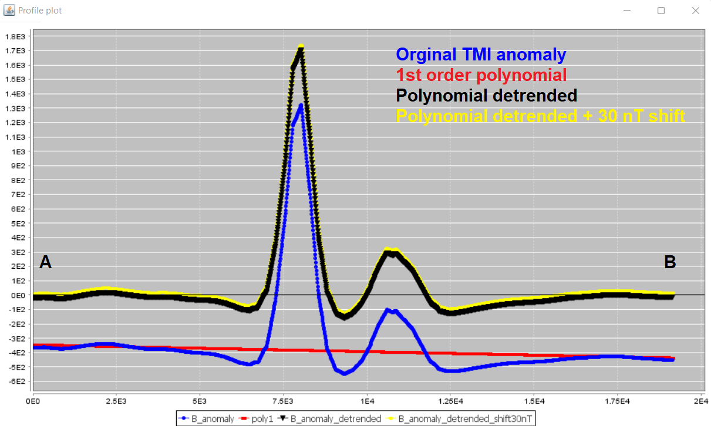

.. _comprehensive_workflow_magnetics_5:

.. include:: <isonum.txt>

Polynomial Detrending and Levelling
===================================

**Polynomial detrending** is used to remove longer period signals from the data in order to more accurately characterize local magnetic anomalies; see the image below. Failure to remove longer period signals from magnetic data prior to inversion can result in artifacts and structures which mischaracterize local anomalies. Depending on the data you have available, there are two cases:

    - **Case 1:** You only have local scale data (no regional data). In this case, polynomial detrending is applied to directly to the local data prior to inversion. Here, we assume that signals from regional and/or nearby structures can be approximated by a low-order polynomial.
    - **Case 2:** You have both local and regional scale data. Polynomial detrending is applied to the regional data only. And the detrended regional data is used to account for regional trends in the local scale data.

.. figure:: https://gpg.geosci.xyz/_images/regional.gif
    :align: center

**Levelling** is sometimes required when you have both local and regional scale data collected during different surveys. Levelling is a DC shift that is added to one of the datasets, so that the background values for both datasets are comparable in the same region.

**For the tutorial data,** we have both local and regional data. As a result, polynomial detrending will be applied to the regional dataset. Upward continued local data are then compared to the detrended regional data to determine the required levelling constant; which can be applied to upward continued local data at any other height. The methodology for removing the regional signals from the local dataset are covered later.

.. _comprehensive_workflow_magnetics_5_approach:

Detrending: General Approach
----------------------------

The general approach for polynomial detrending is to select the set of data points which are part of the 'background'; i.e. away from any local-scale anomalies. Then to fit these data with a low-order polynomial. Within the GIFtools framework, the steps are as follows:

    1. :ref:`Plot the data with VTK <viewData>`. Under 'current data', select the data column you wish to detrend.
    2. Click the 'Edit' tab. Under 'Data selection', click one of the selection options and start to select data on the data map. *For the rectangular option, you can hold Ctrl and append multiple selections*
    3. Click the 'Regional fit'. Here you can

        - Fit the highlighted or not highlighted data
        - Choose the order to the polynomial used to fit these points (usually 0th or 1st or polynomial)
        - Provide the name for the output data column
    
    4. Then click 'OK' to create the resulting data column with the polynomial defined at all survey locations.
    5. Close the VTK plotting
    6. Use :ref:`column calculator <objectCalculator>` to subtract the polynomial from the data
    7. Reopen the VTK plotting to examine result. Results can be examined with data maps, or by examining individual profiles ('Profiler' tab)

.. important::

    - Classifying data points as being part of the background or as being part of the anomalous signal is a subjective process.
    - Magnetic anomalies produce anomalous lows as well. These locations should not be classified as background!
    - Even after polynomial detrending is applied, there may be background regions with negative data values that cannot easily be fit with a strictly positive susceptibility model. In this case, you may detrend with a different polynomial fit OR apply a small DC shift.

Detrending and Levelling Tutorial Data
--------------------------------------

Regional Tutorial Data
^^^^^^^^^^^^^^^^^^^^^^

For the regional magnetic data, a 1st order polynomial was used to fit the set of selected background points. We were careful not to include any small scale anomalies or obvious lows. The polynomial indicates a significant linear trend along the NNE direction. A profile trending roughly along the same direction as the Earth's declination is shown below. The 1st order polynomial generally does a good job of detrending the data. However, we noticed some background regions had coherent negative values. During a preliminary regional magnetic inversion, we found it difficult for the data to be fit by a strictly positive susceptibility model. As a result, we applied a DC shift of **+30 nT** to the regional data after detrending.

.. figure:: images/polynomial_detrending_points.png
    :align: center
    :width: 700

    Polynomial detrending applied to regional tutorial data.

Local Tutorial Data
^^^^^^^^^^^^^^^^^^^

For the local magnetic data, we are interested in comparing final inversion results when regional data are and are not available. As a result, we:

    - used a 1st order polynomial to fit the background, then subtracted it to obtain a data column we are calling *B_anomaly_poly_detrended*. This data column will be inverted to recover a magnetic susceptibility model in the case where regional data are not available.
    - applied a levelling constant of +380 nT to all upward continued and unshifted TMI anomaly data. Regional removal must be applied to this data column prior to local-scale inversion. Note that the levelling constant is quite close to the value of the first order polynomial region of the local survey, plus the DC shift of 30 nT.

