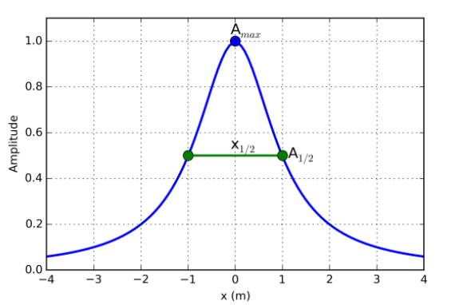
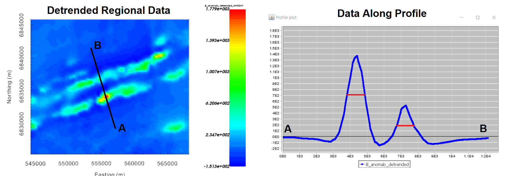
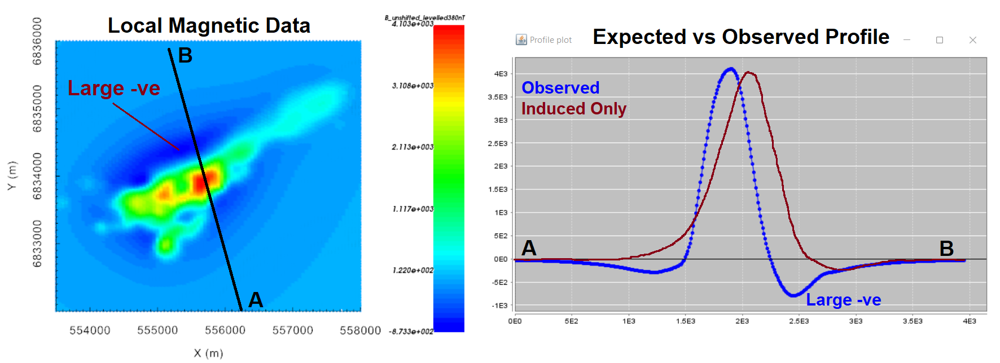

.. _comprehensive_workflow_magnetics_6:

.. include:: <isonum.txt>

Data Interpretation (including remanence)
=========================================

At this point upward continuation, reduction to pole and/or polynomial detrending methods have been applied in order to better characterize target anomalies; both local and regional (if available). Prior to inversion, data maps and profiles can be used to:

    - roughly estimate the depth to structures based on anomaly half-width
    - infer the presence of significant magnetic remanence
    - estimate the minimum station spacing require to constrain target anomalies
    - estimate data uncertainties from closely spaced along-line data

.. _comprehensive_workflow_magnetics_6_halfwidth:

Anomaly Half-Width
------------------

More deply buried targets produce broader and smoother magnetic anomalies. As a result, there is a direct correlation between the depth to a magnetized body and the anomaly it produces. For a magnetic dipole, the elevation difference between the height at which the data are collected and the dipole's location (:math:`\Delta z`) is roughly equal to the width of the anomaly (:math:`x_{1/2}`) at half its amplitude (:math:`A_{1/2}`), i.e.

.. math::
    \Delta z \approx x_{1/2}

Obviously the majority of targets are not magnetic dipoles. You can overestimate the depth if the anomaly is caused by a shallower and wider structure. And for vertical pipe-like structures, :math:`\Delta z` is approximately 1/2 the half-width. That being said, our simple relationship can be used to roughly estimate the lower extent of the core mesh region. It can also be used to better unstand the scale of the magnetic anomalies observed within the survey region.

**For the regional magnetic data,** the detrended magnetic anomaly data are shown below. The half-width is crudely labeled for two distinct anomalies. Assuming the anomalies are not attributed to vertical pipe-like structures, the core mesh region should extend 1000 m +/- 20\% below the Earth's surface.

Remanence
---------

In the :ref:`remanence portion of the understanding anomalies section <comprehensive_workflow_magnetics_1_remanence>`, we learned that:

    - purely induced magnetization produces magnetic anomalies that are oriented along the directly of the Earth's declination angle
    - observed anomalies that differ significantly from the expected anomalies produced by strictly induced magnetization are likely contaminated with remanent magnetization.

So one way to infer remanence is to compare the observed data to the expected anomaly for purely induced magnetization.

**Regarding the local totorial data:** the inducing field is practically vertical (inclination of 80.35 degrees), thus we generally don't expect large negative regions on either side of a large positive anomaly; especially for data collected at sufficient height. The data map showed a significant 'low' region to the northwest of the target and a smaller 'low' region to the southeast. With complex geologies, it is possible these anomalies are produced strictly by induced magnetization. However, the profile illustrates an observed anomaly which more closely resembles the anomaly for a lower inclination angle; indicating possible remanence.

    Levelled magnetic data at 100 m flight height.

