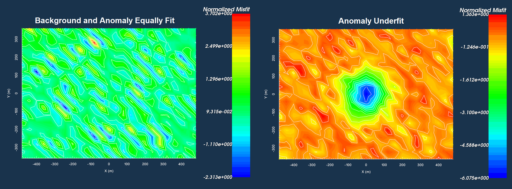

.. _comprehensive_workflow_magnetics_6:

.. include:: <isonum.txt>

Uncertainties
=============

.. important:: **We are not going to assign uncertainties to the data at this moment, as we must first detrend/remove regional signals prior to inversion. Here, we are simply providing a general approach for when it is time to assign uncertainties.**

Here, we provide a basic approach for assigning uncertainties to magnetic data. The role of uncertainties in geophysical inversion is presented in the :ref:`fundamentals of inversion <Fundamentals_Uncertainties>`. When assigning uncertainties, we want to ensure we prioritize fitting the anomaly and not the background.

General Approach
----------------

Percent vs. Floor Uncertainty
^^^^^^^^^^^^^^^^^^^^^^^^^^^^^

**Uncertainties assigned to magnetic data should generally be defined by a floor uncertainty**. If a percent uncertainty is included, much larger uncertainties are applied to the data characterizing the target anomaly. As a result, the recovered model will likely underfit the anomaly and overfit the background. Recovered models in this case are also likely to recover structures that underestimate the amplitude of the target anomaly.

The level of uncertainty on magnetic data is **generally up to several nanoTeslas**. You may choose some fraction of the largest anomaly value. Or you may choose a value based on the uncertainty associated with a given magnetic sensor.

Below, we show the normalized misfit maps resulting from the inversion of TMI anomaly data for 2 different sets of uncertainties. On the left, a uniform floor uncertainty was assigned to the data. We can see there are no coherent artifacts in the misfit map, indicating the anomaly and background are fit equally. On the right, the uncertainties consisted of a floor and a percent. The misfit map shows that the anomaly is underfit relative to the background.

Fitting Anomalies Better
^^^^^^^^^^^^^^^^^^^^^^^^

When a uniform floor uncertainty is applied to the data, it is still possible for the recovered model to overfit the background and underfit the target anomaly. This generally occurs when the reference model is a good characterization of the background. In this case, the background is already well-fit by the reference model and we do not need to fit the anomaly very well in order for the inversion to reach the target misfit. To remedy this, we sometimes select regions of the data in proximity of magnetic anomalies and apply a lower floor uncertainty. Something between 0.1 - 0.5 times the background floor uncertainty usually works.

Uncertainties Assigned to Tutorial Data
---------------------------------------

