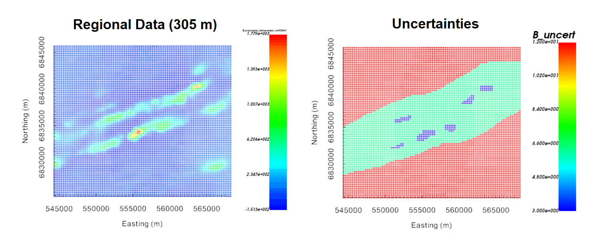
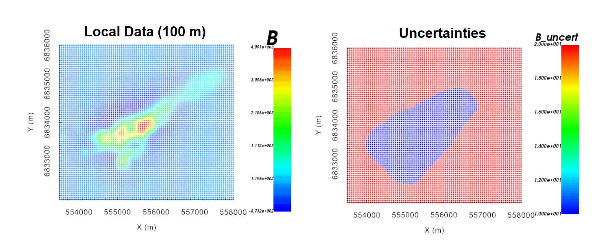

.. _comprehensive_workflow_magnetics_7:

.. include:: <isonum.txt>

Uncertainties
=============

Here, we provide a basic approach for assigning uncertainties to magnetic data. The role of uncertainties in geophysical inversion is presented in the :ref:`fundamentals of inversion <Fundamentals_Uncertainties>`. When assigning uncertainties, we want to ensure we prioritize fitting the anomaly and not the background.

General Approach
----------------

.. note:: When the inversion is complete, we will be able to assess whether the estimated uncertainties on our data were correct. If not, the inversion will need to be re-run with a new set of uncertainties.

Percent vs. Floor Uncertainty
^^^^^^^^^^^^^^^^^^^^^^^^^^^^^

**Uncertainties assigned to magnetic data should generally be defined using floor uncertainties**. If a percent uncertainty is included, much larger uncertainties are applied to large anomalous values; i.e. the data characterizing the target anomaly. As a result, the recovered model will likely underfit the amplitude of the anomaly and overfit the background.

**For most magnetic survey instruments,** the uncertainty on the measurements is up to several nanoTeslas. When the data are smooth and the amplitude of magnetic anomalies are only several hundred nanoTeslas, this represents a good first estimate of the data uncertainties. 

**In the presence of more compact large amplitude anomalies,** it may be difficult for the inversion to converge to the target misfit if the global level of uncertainty is only a few nanoTeslas. In this case, you may assign a floor value equal to some small percent of the largest observed anomaly value. A reasonable estimate is 0.25\%-2\% the size of the large observed anomaly value. 

Below, we show the normalized misfit maps resulting from the inversion of TMI anomaly data for 2 different sets of uncertainties. On the left, a uniform floor uncertainty was assigned to the data. We can see there are no coherent artifacts in the misfit map, indicating the anomaly and background are fit equally. On the right, the uncertainties consisted of a floor and a percent. The misfit map shows that the anomaly is underfit relative to the background.

.. figure:: images/uncertainties.png
    :align: center
    :width: 700

Fitting Anomalies Better
^^^^^^^^^^^^^^^^^^^^^^^^

When a uniform floor uncertainty is applied to the data, it is still possible for the recovered model to overfit the background and underfit the magnetic anomalies. This generally occurs when the reference model is a good characterization of the background. In other words, the background is already well-fit by the reference model and we do not need to fit the anomaly very well in order for the inversion to reach the target misfit. To remedy this, we sometimes select the regions of the data in close proximity to magnetic anomalies and apply a lower floor uncertainty to these regions. Something between 0.1 - 0.5 times the background floor uncertainty usually works.

Uncertainties Assigned to Tutorial Data
---------------------------------------

**For the regional tutorial data,** we looked at the the largest observed anomaly value after the data were detrended using a 1st order polynomial. The largest value was ~1800 nT. We assumed that globally, the level of uncertainty was roughly 0.5\% the largest anomaly value (or about 9 nT). Preliminary inversion attempts using a simple floor uncertainty recovered models which underfit the observed anomalies. To remedy this, a background uncertainty of 12 nT was assigned to the background region, a floor uncertainty of 6 nT was assigned to the region containing the magnetic anomalies, and a floor uncertainty of 3 nT was assigned to all anomalous values above 300 nT. We found the 3 nT uncertainty was necessary to fit the largest observed anomaly values.

    Regional magnetic anomaly data (left). Uncertainties used for regional magnetic inversion (right)

**For the local tutorial data,** we looked at the the largest observed anomaly value after the data were upward continued to 100 m. The largest value was ~4100 nT. We assumed that globally, the level of uncertainty was roughly 0.5\% the largest anomaly value (or about 20 nT). Preliminary inversion attempts using a simple floor uncertainty recovered models which underfit the observed anomalies. To remedy this, a background uncertainty of 20 nT was assigned to the background region and a floor uncertainty of 10 nT was assigned to the region containing the magnetic anomaly.

    Magnetic anomaly shifted and upward continued to 100 m (left). Uncertainties used for local magnetic inversions (right)

