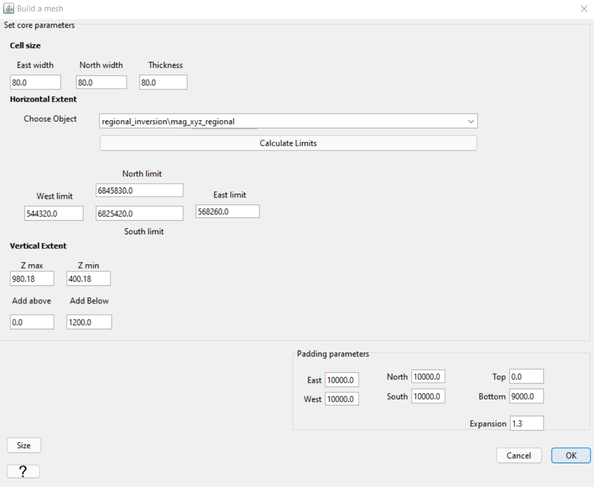
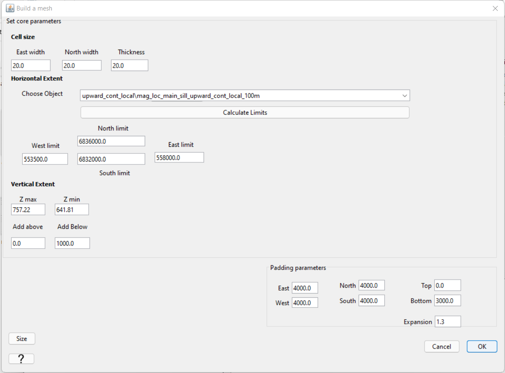

.. _comprehensive_workflow_magnetics_8:

.. include:: <isonum.txt>

Mesh Design
===========

Here, we describe a general approach for designing meshes for magnetic inversion.

Downsampling
------------

General Approach
----------------

**Depth of core mesh region:** As mentionned in the :ref:`interpretation <comprehensive_workflow_magnetics_6_halfwidth>` section, the depth to a magnetized body is correlated with the width of the anomaly it produces. The largest halfwidth for anomalies within the regional of interest sets a rough estimate for the lower bound of the core mesh region.

**Minimum cell dimension:** The dimensions of the cells in the core mesh region depend on the smallest spatial frequency contained within the data. When data are very smooth and contain lower spatial frequencies, coarser meshes can be used and the inversion will demonstrate reasonable convergence. If data contains significant higher frequency signals, more cells are required between each data point in order for the inversion to converge appropriately; i.e. reach target misfit with a geologically reasonable model.

Ideally, the line spacing and flight height will have been chosen with some consideration to the magnetic anomalies produced by local structures. In general, the minimum horizontal cell width should be at AT LEAST 75\% the smallest distance between data points. Never have 2 data points lying above the same cell!!! And if possible, 2-3 cells between data points is ideal.

**Padding:** Padding is required to fit any remaining longer period signals that remain in the data. The longest spatial period signal that can be characterized by the data is equal to the dimensions of the survey area. As a result, the thickness of the padding should be 0.5-2 times the width of the survey region. For tensor meshes, we pad out exponentially to reduce the number of redundant cells. An expansion factor of *1.1-1.3* is ideal. Do not exceed a padding factor of 1.5!!!

Meshes for Tutorial Data
------------------------

Regional Mesh
^^^^^^^^^^^^^

Local Mesh
^^^^^^^^^^

