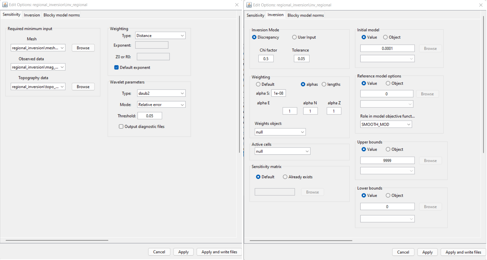

.. _comprehensive_workflow_magnetics_8:

.. include:: <isonum.txt>

Regional Inversion (Optional)
=============================

If available, the inversion of regional-scale data provides a regional-scale model that can be used to remove regional trends from local magnetic data.
Unlike simple detrending, the inclusion of regional-scale data in processing

Cropping
--------

Detrending
----------

Magnetic data generally contains signals whose spatial wavelengths are larger than the dimensions of the survey area.
For regional scale data, we use polynomial detrending to remove these signals. The process of polynomial detrending was previously
presented when discussing :ref:`equivalent source inversion <comprehensive_workflow_magnetics_3_detrend>`. The steps are as follows:

    - :ref:`Plot the regional data with VTK <viewData>`
    - click the 'Edit' tab
    - choose one of the selection options and select data on the data map. *For the rectangular option, you can hold Ctrl and append multiple selections*
    - click the 'Regional fit' tab and fit the desired polynomial to either highlighted or not highlighted data
    - click 'OK' to create the resulting data column with the polynomial defined at all survey locations.
    - close the VTK plotter
    - subtract the polynomial column from the original anomaly data and define a new column (*B_anomaly_detrended*) using the :ref:`column calculator <objectCalculator>`.

**For the regional tutorial data,** the polynomial and resulting detrended data are 

Uncertainties
-------------

The general approach for assigning uncertainties to magnetic data was discussed in :ref:`the previous section <comprehensive_workflow_magnetics_5>`.
**For the regional tutorial data,** a background floor uncertainty of 2 nT was assigned. In the region near anomalous structures, a floor uncertainty of 1 nT was assigned. See below.

Regional Mesh
-------------

**Generate a mesh:**

    - :ref:`Create 3D mesh <create_mesh>` under the 'Create' drop-down menu
    - **Cell size:** set the cell size for the core mesh cells. Cell dimensions CANNOT be larger than the minimum horizontal spacing between data points. A cells size that is 0.5-0.8 times the minimum horizontal spacing generally works.
    - **Horizontal Extent:** under 'Choose Object', select the local magnetic data object then click 'calculate limits'. This defines your core mesh region
    - **Vertical Extent:** Add a thickness equal to 2-4 layers of cells
    - **Padding Parameters:** Do not pad in the vertical direction. Pad out sufficiently in the horizontal. Larger padding thicknesses are required if you are upward continuing significantly.

**For the local tutorial data,** the following parameters were used.

Running the Inversion
---------------------

We can now perform the local equivalent source inversion

    - :ref:`Create a MAG3D v6.0 inversion object <createMagInv>`
    - Use :ref:`edit options <invEditOptions_Mag3D>` to set the inversion parameters
    - Click *Apply and write files*
    - Run weights
    - Run sensitivities
    - Run inversion
    - :ref:`Load final result <invLoadResults>`

**For the local tutorial data,** the following inversion parameters were used.

Discussion of Inversion Parameters
----------------------------------

.. note:: The parameters chosen for inversion of the tutorial data set were experimentally derived. The numbers used here worked well for inverting this dataset but should not necessary be used as general default values!

**Regarding sensitivity weighting:**

Default parameters for sensitivity weighting are applied. The role of sensitivity weighting in potential field inversion is discussed in :ref:`fundamentals of inversion <Fundamentals_DepthDistMatrix>`.

**Regarding chi factor:**

By setting a chi factor of 1, you are assuming that you have accurately characterized the global level of uncertainty on the data. If you have over-estimated the uncertainties, the inversion will reach target misfit and terminate before recovering a model that accurately fits the data. By setting the chi factor to 0.5, we are able to view models that lie further along the Tikhonov curve. As the user, you can then pick the model you feel properly fits the observed data.

**Regarding the alpha parameters:**

We have no a-priori information that can be used to construct a reference model for the regional inversion. Thus we set :math:`\alpha_s` = 1e-8 (something very small) in order to recover the 'smoothest model'. That is, we recover a model which does not depend on the reference model; i.e. is purely driven by the data.

**Regarding the starting model:**

A starting model of 0.0001 SI was chosen as the starting model. This is done because a starting model of 0 SI would not produce a step direction for updating the model. So in practice, we just choose something small if we do not have a-priori information that guides our choice for a starting model.

**Regarding the bounds:**

Here, we set a lower bound of 0 SI to enforce a positivity constraint on the recovered susceptibility model.

Analyzing Inversion Results
---------------------------

Convergence
^^^^^^^^^^^

Data Misfit
^^^^^^^^^^^

Recovered Model
^^^^^^^^^^^^^^^