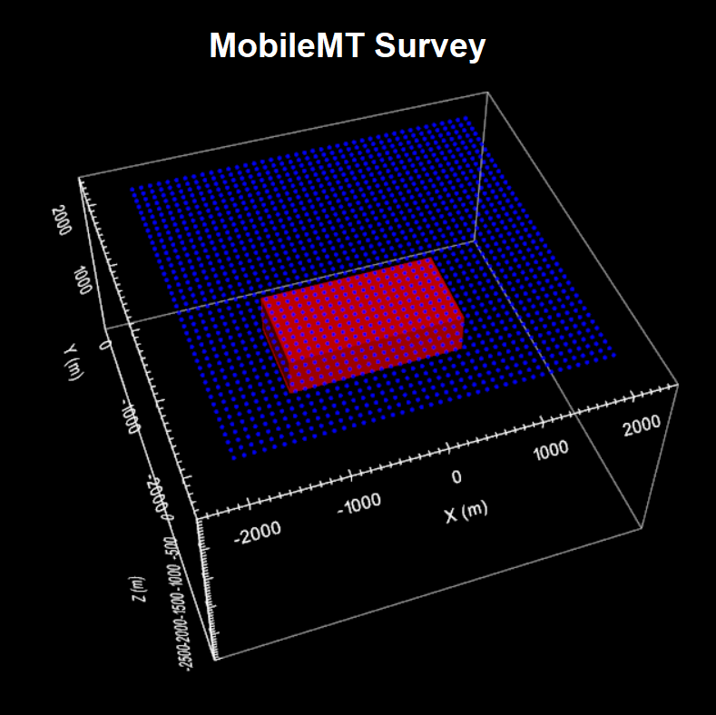

.. _comprehensive_workflow_mmt_1:

Understanding MobileMT Data
===========================

In order to properly interpret MobileMT data, it is import to first understand the shape and characteristics of the anomalies due to basic structures. Here, we investigate the MobileMT anomalies by simulating data over a compact conductor. We compare anomalies in MobileMT data to those in classic MT data. And we investigate the impact of the electric fields measured at the base station on MobileMT data.

Admittance tensor and MobileMT data
-----------------------------------

MobileMT systems measure 2 orthogonal horizontal components of the electric field (Ex, Ey) at a base station located on the Earth's surface, and 3-component magnetic field data (Hx, Hy, Hz) at locations throughout the survey region. For each datum, the components of the magnetic field are linearly related to the measured electric field components at the base station via an admittance tensor :math:`\mathbf{Y}`, such that:

.. math::
    \begin{bmatrix} H_x \\ H_y \\ H_z \end{bmatrix} =
    \begin{bmatrix} Y_{xx} & Y_{xy} \\ Y_{yx} & Y_{yy} \\ Y_{zx} & Y_{zy} \end{bmatrix}
    \begin{bmatrix} E_x \\ E_y \end{bmatrix}
    :label: admittance_tensor

The datum for MobileMT is an apparent conductivity :math:`\sigma_a`. In much of the `theory presented by Expert Geophysics <https://www.expertgeophysics.com/wp-content/uploads/2019/08/MobileMT-acquisitionprocessing.pdf>`__ for their MobileMT system, the apparent conductivity is related to the determinant of the 3x2 admittance tensor as follows:

.. math::
    \sigma_a = \mu \omega \big | det(\mathbf{Y})^2 \big |

The exact method for taking the determinant of the 3x2 matrix is considered proprietary by Expert Geophysics. However, most practitioners assume that since Hz is much weaker than Hx and Hy in the absence of major 3D effects, the last row of the admittance tensor can be neglected and the determinant reduces to:

.. math::
    det(\mathbf{Y}) \approx \sqrt{Y_{xx} Y_{yy} - Y_{xy} Y_{yx}}

For a 3-dimensional Earth, the reduced admittance tensor can be defined using the ratios of electric and magnetic field components in both the x and y directions for 2 orthogonal plane wave polarizations; one polarization with the electric field along the x axis and one polarization with the electric file along the y axis. We can define the reduced admittance tensor as the inverse of the :ref:`impedance tensor used to define classic MT data <comprehensive_workflow_mt_1>`. Therefore:

.. math::
    \begin{bmatrix} Y_{xx} & Y_{xy} \\ Y_{yx} & Y_{yy} \end{bmatrix} =
    \begin{bmatrix} H_{x}^{(1)} & H_{x}^{(2)} \\ H_{y}^{(1)} & H_{y}^{(2)} \end{bmatrix}
    \begin{bmatrix} E_{x}^{(1)} & E_{x}^{(2)} \\ E_{y}^{(1)} & E_{y}^{(2)} \end{bmatrix}^{-1}
    :label: admittance_tensor_2

where 1 and 2 refer to fields associated with plane waves polarized along two perpendicular directions. The apparent conductivity values can therefore be computed according to the reduced admittance tensor if the appropriate electric and magnetic field measurements are obtained.
    

.. _comprehensive_workflow_mmt_1_conductor:

MobileMT data over a compact conductor
--------------------------------------

Here, we plot the apparent conductivities from simulated MobileMT data collected over a conductive block. For comparison, we also plot apparent conductivities computed from the Zxy component of surface MT data. The conductor is buried at a depth of 500 m. Its East-West dimension is 2000 m and its North-South dimension is 1000 m. The background conductivity is 0.001 S/m and the conductivity of the block is 0.1 S/m. The base station used to collect horizontal electric field measurements for the MobileMT data was located at (-4000, -4000, 0); far away from the conductor.

    MobileMT survey geometry.

For both MobileMT and classic MT data, apparent conductivities/resistivities can be used to:

    - estimate the background resistivity of your survey region
    - determine how the resistivity of an area changes with respect to depth, as different frequencies are sensitive to different depths
    - more easily identify potential conductive and/or resistive targets

Below, we plot apparent conductivities at 10 Hz, 100 Hz and 1000 Hz. Away from the block, the apparent conductivities in both the MobileMT and classic MT plots are equal to the background conductivity of 0.001 S/m. This is expected when the background conductivity is homogeneous. At the highest frequency, the skin depth is small and we are not sensitive to the block, so the apparent conductivity is once again equal to the background conductivity.

For both data types, the existence of the conductor reduces the apparent conductivities for frequencies sensitive to the conductor.
However, the reduction in apparent conductivity values computed from classic MT data is much larger than is observed for MobileMT data.
This is because the electric field measurements used to compute MobileMT data are collected at a base station located far away from the conductive block.
And since the electric field measured at the base station is not sensitive to the block, the magnetic fields are solely responsible for the decrease in observed apparent conductivities. The largest observed anomalies in the MobileMT and classic MT data also seem to appear at different frequencies.

.. figure:: images/conductor_anomaly.png
    :align: center
    :width: 700

    MobileMT apparent conductivities at 10 Hz, 100 Hz and 1000 Hz.

.. figure:: images/conductor_anomaly_mt.png
    :align: center
    :width: 700

    Apparent conductivities from MT data at 10 Hz, 100 Hz and 1000 Hz.

.. _comprehensive_workflow_mmt_1_base_station:

Impact of features near the base station
----------------------------------------

Here, we demonstrate the impact of conductive/resistive structures near the MobileMT base station on the apparent conductivity values. MobileMT data are again simulated over a conductive block. In this case however, the base station (-4000, -4000, 0) is located over a region with a conductivity of 0.01 S/m. 

.. figure:: images/conductor_survey_base_station.png
    :align: center
    :width: 450

    MobileMT survey geometry.

Apparent conductivities are computed using electric field measurements at the base station. Therefore the conductivity near the base station heavily influences MobileMT data. Let us examine the apparent conductivities at 1000 Hz. Once again, the data are not sensitive to the conductive block due to the skin depth of the host. However, the apparent conductivities are ~0.008 S/m despite the host conductivity near the conductor being 0.001 S/m.

The existence of moderately conductive material at the base station has decreased the amplitude of the measured electric fields, and in turn, increased the magnitudes of apparent conductivity values. The opposite would be observed if the region around the base station were more resistive. This "shift" in apparent conductivities is observed at other frequencies. However the amplitude of local anomalies relative to the background value for each frequency seem to be relatively well-preserved.

.. figure:: images/conductor_anomaly_base_station.png
    :align: center
    :width: 700

    MobileMT apparent conductivities at 10 Hz, 100 Hz and 1000 Hz.

From this experiment, we conclude that MobileMT data are sensitive to the distribution of electrical conductivities in the vicinity of both the base station location and the region of interest. And although structures near the base station will produce a "shift" in the observed apparent conductivities, the amplitudes of MobileMT data anomalies relative to the background are determined by the observed magnetic field. 
