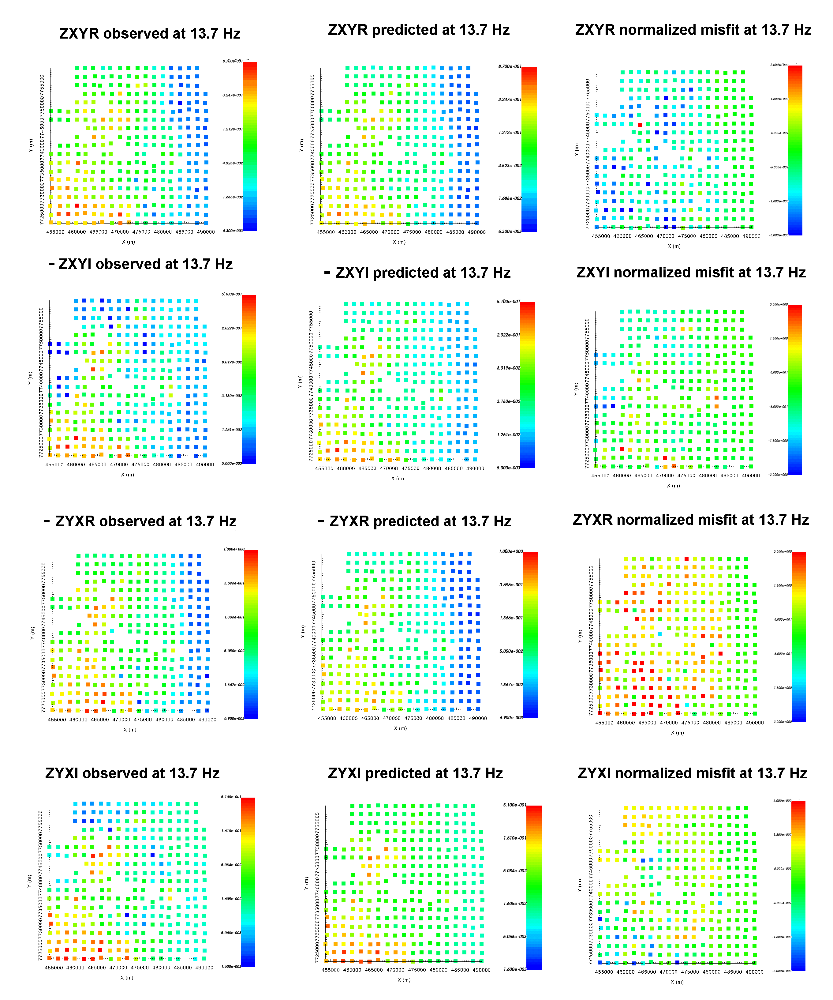
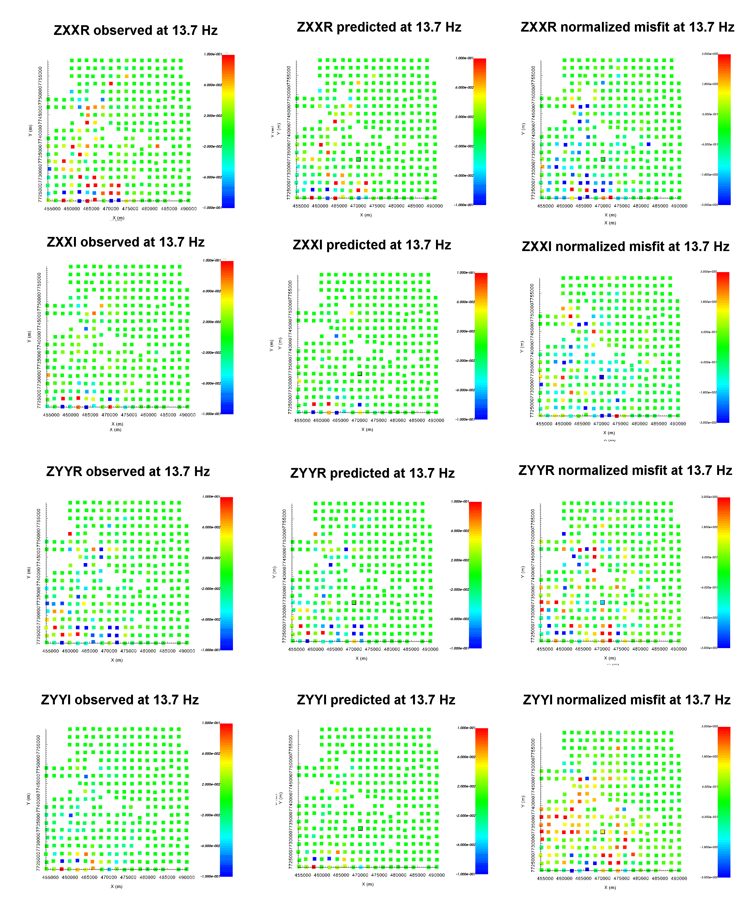
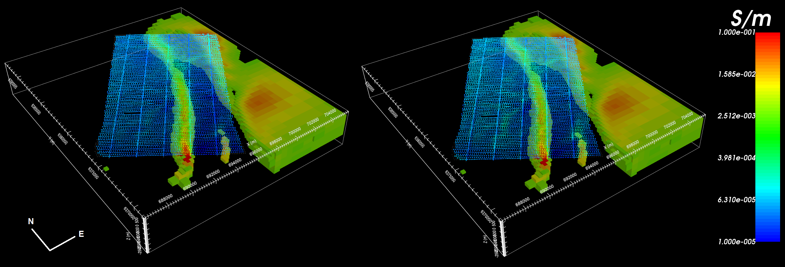

.. _comprehensive_workflow_mt_7:

Inversion Results
=================

Here, we demonstrate a common practice for examining the output of the inversion code. This includes examining the convergence, the data misfit and the recovered model. Before looking at recovered models, the user is **strongly** urged to examine the convergence of the algorithm first (Tikhonov curve). By examining the convergence, we can:

	- determine if our data is in UBC-GIF data convention. The data misfit will be large and will not reduce at each iteration otherwise.
	- see if the inversion is able to reach target misfit
	- infer whether the target misfit is reasonable; i.e. did we globally over or under-estimate the uncertainties on our data

We then assess how well a given recovered model explains the data by looking at the predicted data, observed data and normalized data misfit maps. From this we can determine whether:

	- the predicted data fits the amplitude, shape and character of observed anomalies for each component and for each frequency
	- the estimated uncertainties were reasonable for each component and for each frequency.
	- the inversion must be re-run with a new set of uncertainties

Only when the convergence and data misfit are acceptable can we infer geological structures from recovered models.

Convergence
^^^^^^^^^^^

Once the inversion result have been loaded (done in the :ref:`inversion section<comprehensive_workflow_mt_6>`)

	- :ref:`View convergence <convergence_curve>`

The Tikhonov curve for our example inversion is shown below. According to the figure:

	- the inversion reaches target misfit (chi-factor = 1 in this case) after 6 iterations. Thus the algorithm is converging over the course of the beta cooling schedule.
	- the Tikhonov curve starts to flatten out at the 4th iteration, indicating the point on the Tikhonov curve after which recovered models start to over-fit the data.

.. figure:: images/convergence.png
    :align: center
    :width: 500

Data Misfit
^^^^^^^^^^^

According the Tikhonov curve, the recovered model at iteration 4 has a good chance of explaining the data without fitting the noise. To be sure however, we must examine the observed data, predicted data and data misfit for the corresponding model. Here are some good questions to ask during this step:

	- Are the prominent anomaly features identified in the observed data also found in the predicted data? Is this true for all components and for all frequencies?
	- Are there obvious coherent features in your normalized misfit map? If so, this indicates you are over-fitting certain regions at the expense of others and that you must assign new uncertainties and re-run the inversion.
	- Are the ranges of normalized misfits for each component and for each frequency generally the same? If not, the uncertainties are not balanced between components and/or frequencies. In this case, new uncertainties should be applied and the inversion should be re-run.

**Off-Diagonal Components:**

    Observed data, predicted data and normalized misfit for all off-diagonal impedance components at 13.7 Hz. For each component, predicted and observe data are plotted on the same scale. All normalized misfit maps are plotted on a range from -3 to 3.

**Diagonal Components:**

    Observed data, predicted data and normalized misfit for all diagonal impedance components at 13.7 Hz. For each component, predicted and observe data are plotted on the same scale (-0.1 - 0.1). All normalized misfit maps are plotted on a range from -3 to 3.

Recovered Model
^^^^^^^^^^^^^^^

The conductivity model recovered at the 4th iteration is shown below. A cutoff of 0.003 S/m was applied. The model was also sliced horizontally at an elevation of 253 m. To show how well structures in the recovered model match data signatures, we plotted the total divergence parameter at 45 Hz and at 180 Hz.

The inversion recovers the large conductive feature that strikes along a bearing of 35 degrees. The conductivity along the recovered feature corresponds well to amplitude of the MT response. A secondary conductive feature is also recovered at the Southernmost tip of the survey area. Along the Eastern end of the of the survey area, MT data and the total divergence parameter indicated the possible presence of another conductor. Although the inversion placed conductive structures in this area, the feature is poorly constrained by the data. 

    Recovered model and total divergence parameter at 45 Hz (left) and at 180 Hz (right).

