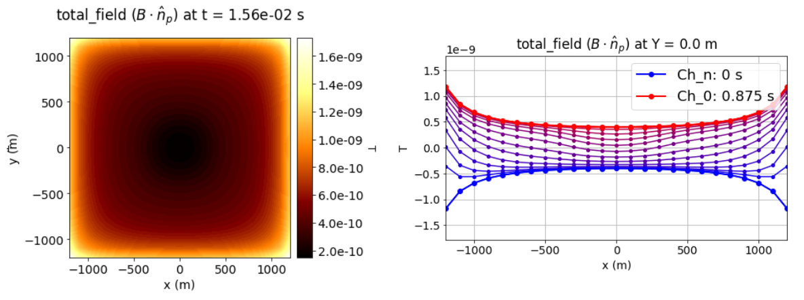
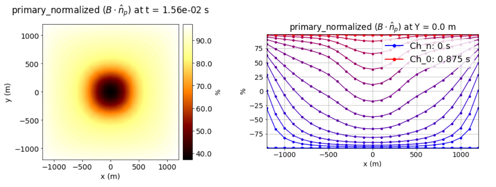

.. _comprehensive_workflow_utem_1:

Understanding UTEM Anomalies
============================

In order to properly interpret UTEM data, it is import to first understand what fields are measured, how the data are plotted and the anomalies for basic structures. Here, we investigate the UTEM anomaly produced by a compact conductor. The knowledge gained here can be used to determine the coordinate system and sign convention for field collected data, and the operations required to transform the raw data into UBC GIF convention.

Introduction to UTEM
--------------------

Survey Geometry and Fundamental Concept
^^^^^^^^^^^^^^^^^^^^^^^^^^^^^^^^^^^^^^^

For UTEM survey, a large inductive loop source is placed on the Earth's surface. Depending on how the loop is coupled with the target, receivers may be located inside or outside the loop. Data may be collected for several sets of loops and receivers in order to excite the target from multiple directions.

    Survey geometry for target near center of the loop (left) and near edge of the loop (right).

During field data collection, the UTEM system measures directional components of dB/dt for a highly regulated triangular waveform; see below. **However,** this is equivalent to measuring the directional components of B(t) for a corresponding step-like waveform. The principal idea of the UTEM system is to collect dB/dt data for the triangular waveform, then transform the raw data so it represents B-field data for the step waveform. The resulting data is effectively the "step response of the Earth". This is explained in the following subsection.

.. figure:: images/waveform.png
    :align: center
    :width: 700

    True transmitter waveform and time channels where dB/dt is measured in the field (left). Step waveform and times at which we convert to B-field data (right).

Defining UTEM Data
^^^^^^^^^^^^^^^^^^

Let :math:`\xi_b(t)` represent some impulse response function for the magnetic field observed at a receiver. For the trangular current waveform :math:`w_{\wedge}(t)` illustrated above, the B-field at the receiver can be represented as a convolution:

.. math::
    B_\wedge (t) = \int_{-\infty}^{\infty} w_\wedge (t) \, \xi_b(t-\tau ) \, d\tau

And for the square waveform :math:`w_{\sqcap}(t)` illustrated above, the B-field at the receiver can be represented as:

.. math::
    B_\sqcap (t) = \int_{-\infty}^{\infty} w_\sqcap (t) \, \xi_b(t-\tau ) \, d\tau

By taking the time-derivative of :math:`w_{\wedge}(t)`, we realize that

.. math::
    \frac{d w_{\wedge}}{dt} = \frac{4}{T} w_\sqcap (t)

where :math:`T` represent the period of both current waveforms. As a result, the time-derivative of the magnetic field observed for the triangular waveform is related to the magnetic field for the step waveform as follows:

.. math::
    B_\sqcap (t)
    = \int_{-\infty}^{\infty} w_\sqcap (t) \, \xi_b(t-\tau ) \, d\tau
    = \frac{T}{4} \int_{-\infty}^{\infty} \frac{\partial w_\wedge}{\partial t} \, \xi_b(t-\tau ) \, d\tau
    = \frac{T}{4} \frac{\partial B_\wedge}{\partial t}

The above expression shows that raw dB/dt data collected during the survey (normalized by the transmitter current amplitude) can be multiplied by T/4 to obtain equivalent B-field data for the step waveform.
**And therefore, UTEM data can be defined as 1) the dB/dt reponse for a triangular waveform, or 2) the B-field for the step waveform.** Conventionally, the B-field representation is interpreted to understand the Earth's response. However, both the dB/dt and B-field representations of the data can be inverted; so long as the correct waveform is used.

Time Channels
^^^^^^^^^^^^^

For UTEM systems, the time channels at which the fields are measured depend on the period of the waveform; generally 0.1 s to several seconds. Unlike most TEM systems, the time channels are organized from latest to earliest. Where *T* denotes the period of the waveform, the time channels for UTEM systems are described below:

- **Ch_0:** The latest time channel. Data at this time channel is supposed to represent the steady-state B-field expected at a sufficient time after the step-on excitation. Ideally this would be measured at time *T/2* , but in practice it is measured slightly earlier.
|

- **Ch_i:** Time channels used for interpretation. Most UTEM systems have roughly 10-13 of these time channels. The latest time channel is at time *Ch_1 ~ T/4*. And from latest to earliest, the time of the channel is decreased by a factor of 2. Thus:

.. math::
    \textrm{Ch_i} \approx \frac{T}{2^{i+1}}

- **Ch_n:** These refer to one or two time channels collected at :math:`t<0`; i.e. before the step-on occurs. For example, we may measure the fields at :math:`t = -T/2^{13}` to capture the steady-state B-field the moment before the step excitation.

.. figure:: images/example_survey_geometry.png
    :align: right
    :width: 250

.. _comprehensive_workflow_utem_1_plotting:

Plotting UTEM Data
------------------

Let us assume the raw field measurements have been converted to B-field data for a step waveform with a current amplitude of 1; i.e. :math:`B_\sqcap (t)`. Here, we define common plotting conventions for UTEM data. The data maps presented here are for UTEM data collected over a conductive block near the middle of a square large loop transmitter. The survey geometry is shown on the right.

Unlike most TEM systems, UTEM instruments measure data during the on-time. The measured fields are dominated by the geometry of the primary field produced by the transmitter. Therefore anomalies resulting from conductive targets are very difficult to identify when the measured fields are plotted directly; see figure below. There are several ways to represent UTEM data that account for the geometry of the transmitter loop and highlight anomalous responses from the Earth. These are defined in the following subsections.

    B-field projected along the direction of the primary field at 1.56e-2 s (left). Same data at each time channel along an Easting transect at y = 0 m (right).

Normalized by Primary Field
^^^^^^^^^^^^^^^^^^^^^^^^^^^

The simplest way to mitigate the masking effect of the primary field is to normalize the data by the absolute value of the primary field. To accomplish this, the path of the transmitter loop must be sufficiently defined by taking GPS coordinates during the survey and converting the values to UTM. For each segment of the wire path, the free-space Biot-Savart field can be computed and summed.

Let :math:`\mathbf{b}_\sqcap(t_i)` represent the total field at time channel *i*, and let :math:`\mathbf{b_p}` represent the free-space B-field for a current amplitude of 1 A. The data values plotted are given by:

.. math::
    \mathbf{d}(t_i) = 100\% \times \Bigg ( \frac{\mathbf{b}_\sqcap(t_i)}{\big | \, \mathbf{b_p} \, \big |} \Bigg )

Therefore we are effectively representing the data as a percentage of the primary field.

    Normalized by primary field data for the B-field projected along the direction of the primary field at 1.56e-2 s (left). Same data at each time channel along an Easting transect at y = 0 m (right).

Primary Field Reduced Data
^^^^^^^^^^^^^^^^^^^^^^^^^^

For each directional component of the data (e.g. x, y, z), we remove the primary field contribution before normalizing by the magnitude of the primary field. Once again, this requires the path of the transmitter loop be defined by location points collected during the survey.

Where :math:`\mathbf{b}_\sqcap(t_i)` represents the total field value at time channel *i*, and :math:`\mathbf{b_p}` represents the free-space magnetic field for a current amplitude of 1 A, the data values plotted are given by:

.. math::
    \mathbf{d}(t_i) = 100\% \times \Bigg ( \frac{\mathbf{b}_\sqcap(t_i) - \mathbf{b_p}}{\big | \, \mathbf{b_p} \, \big |} \Bigg )

.. figure:: images/primary_reduced.png
    :align: center
    :width: 700

    Primary reduced data for the B-field projected along the direction of the primary field at 1.56e-2 s (left). Same data at each time channel along an Easting transect at y = 0 m (right).

Channel Reduced Data
^^^^^^^^^^^^^^^^^^^^

For a step-on current waveform, the measured total field should asymptote to the primary field after sufficent time; i.e. when all induced currents have sufficiently diffused. If we assume the inductive response is negligible at the latest time channel, then the data measured at the latest time channel is equivalent to the primary field; i.e. :math:`\mathbf{b}_\sqcap(t_{max}) \approx \mathbf{b_p}`.

The channel reduced representation of the data is given by:

.. math::
    \mathbf{d}(t_i) = 100\% \times \Bigg ( \frac{\mathbf{b}_\sqcap(t_i) - \mathbf{b_\sqcap}(t_{max})}{\big | \, \mathbf{b}_\sqcap(t_{max}) \, \big |} \Bigg )

.. figure:: images/primary_reduced.png
    :align: center
    :width: 700

    Channel reduced data for the B-field projected along the direction of the primary field at 1.56e-2 s (left). Same data at each time channel along an Easting transect at y = 0 m (right).

The first two plotting approaches depended on having a high level of confidence that primary field computations are possible and sufficiently accurate. Channel reduced data offers a solution when this is not the case. However, the assumptions we made when defining channel reduced data are not correct in the presence of highly magnetized bodies.

Anomaly over a Conductive Block (Primary Normalized)
----------------------------------------------------

Here, we discuss the characteristics of the UTEM data for a conductive block located near the center of a large square loop. Fields are measured several meters above the surface of the Earth. Data maps for the x, y and z components of the B-field normalized by the absolute value of the primary field are plotted below.

.. figure:: images/primary_normalized.gif
    :align: center
    :width: 700

**At t = 0:**

- We are effectively seeing the steady-state B-field right before the step-on; i.e. for a current of -1 A.
- The data map for the field projected along the direction of the primary field should be -100\% everywhere since :math:`\mathbf{b}_\sqcap (0)=-\mathbf{b_p}`. 

**At early times:**

- At t = 0 s, the primary field changes from :math:`-\mathbf{b_p}` to :math:`\mathbf{b_p}`. This produces a change in magnetic flux density equal to :math:`2\mathbf{b_p}`!!!
- Thus at sufficiently early times, currents induced in the ground produce secondary fields that are both stronger than and oppose the primary field. At these times, normalized data show negative percentage values.
- In the GIF provided, we can actually see the signature of the induced currents as they diffuse away from the transmitter loop over time; especially in the x and y components.
- The strength of the secondary fields relative to the primary field is weakest near the transmitter wire, so positive values are expected at earlier time channels.

**At mid-times:**

- "Mid-time" refers to time channels where currents induced in the host rock have decayed sufficiently but currents induced in conductive targets have not.
- Over these times, we try to identify conductive structures.
- These time channels provide the best data for inversion, as they are most sensitive to the target.

**At late-times:**

- During the "late-times", we expect the measured fields to asymptote towards the steady-state B-field long after the step-on; i.e. we expect :math:`\mathbf{b}_\sqcap (t) \rightarrow \mathbf{b_p}`.
- This occurs at earlier times if the Earth is more resistive and at latter time if the Earth is more conductive; a fact that helps determine the appropriate period for your current waveform.
- The data map for the field projected along the direction of the primary field should approach 100\% everywhere since after sufficient time :math:`\mathbf{b}_\sqcap (t) \approx \mathbf{b_p}`.

.. important::
    - In the case of **primary reduced data**, the removal of the free-space primary field effectively shifts the data maps so that they asymptote to 0\%. So long as *Ch_0* is approximately measuring a steady-state field, this is also true for **channel reduced data**.  

Anomaly over a Conductive and Susceptible Block (Primary Normalized)
--------------------------------------------------------------------

Here, we discuss the characteristics of the UTEM data for a conductive and magnetically susceptible block located near the center of a large square loop. Fields are measured several meters above the surface of the Earth. Data maps for the x, y and z components of the B-field normalized by the absolute value of the primary field are plotted below.

.. figure:: images/primary_normalized_susceptible.gif
    :align: center
    :width: 700

**At t = 0:**

- We are effectively seeing the steady-state B-field right before the step-on; i.e. for a current of -1 A.
- In this case, the data map for the total field projected along the direction of the primary field has anomalous values below -100\% . These anomalous values are produced by the magnetostatic response of the block.

**At early times:**

- At sufficiently early times, currents induced in the ground produce secondary fields that much stronger than the magnetic response. These times are dominated by EM induction.
- It is not possible to ascertain whether the block is susceptible over these time channels.

**At mid-times:**

- "Mid-time" refers to time channels where currents induced in the host rock have decayed sufficiently but currents induced in conductive targets have not.
- Over these times, we try to identify conductive structures.
- These time channels provide the best data for inversion, as they are most sensitive to the target.

**At late-times:**

- During the "late-times", the fields asymptote towards the steady-state total-field for a transmitter current of 1 A.
- It is over these time channels we generally examine the data maps to determine if there are susceptible structures.
- In this case, the data map for the field projected along the direction of the primary field has values larger than 100\% at locations near susceptible bodies.