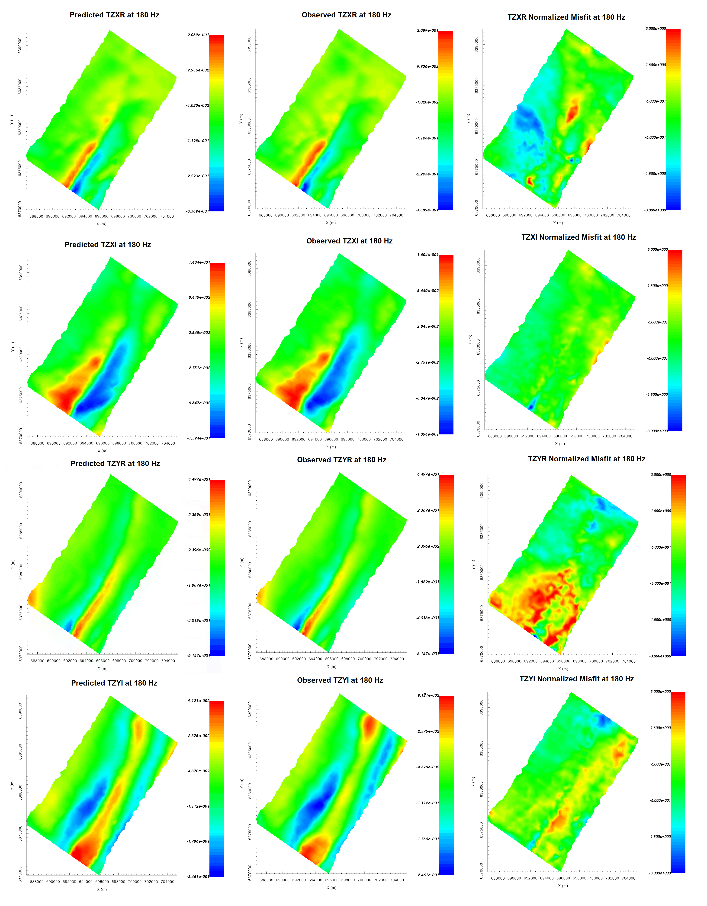

.. _comprehensive_workflow_ztem_7:

Inversion Results
=================

Here, we demonstrate a common practice for examining the output of the inversion code. This includes examining the convergence, the data misfit and the recovered model. Before looking at recovered models, the user is **strongly** urged to examine the convergence of the algorithm first (Tikhonov curve). By examining the convergence, we can:

	- determine if our data is in UBC-GIF data convention. The data misfit will be large and will not reduces at each iteration otherwise.
	- see if the inversion is able to reach target misfit
	- infer whether the target misfit is reasonable; i.e. did we globally over or under-estimate the uncertainties on our data

We then assess how well a given recovered model explains the data by looking at the predicted data, observed data and normalized data misfit maps. From this we can determine whether:

	- the predicted data fits the amplitude, shape and character of observed anomalies for each component and for each frequency
	- the estimated uncertainties were reasonable for each component and for each frequency.
	- the inversion must be re-run with a new set of uncertainties

Only when the convergence and data misfit are acceptable can we infer geological structures from recovered models.

Convergence
^^^^^^^^^^^

Once the inversion result have been loaded (done in the :ref:`inversion section<comprehensive_workflow_ztem_6>`)

	- :ref:`View convergence <convergence_curve>`

The Tikhonov curve for our example inversion is shown below. According to the figure:

	- the inversion reaches target misfit (chi-factor = 0.5 in this case) after 7 iterations. Thus the algorithm is converging over the course of the beta cooling schedule.
	- the inversion reaches a chi-factor of 1 (data misfit equals number of data) somewhere between the 4th or 5th iteration. Assuming the estimate of our uncertainties is correct, the optimum recovered model should correspond to a chi-factor of 1.
	- after the 5th iteration, the data misfit does not decrease very much as beta is decreased. This indicates models after the 5th iteration are likely over-fitting the data, and that our optimum recovered model is before the 6th iteration.

.. figure:: images/convergence.png
    :align: center
    :width: 500

Data Misfit
^^^^^^^^^^^

According the Tikhonov curve, the recovered model at iteration 5 has a good change of explaining the data without fitting the noise. To be sure however, we must examine the observed data, predicted data and data misfit for the corresponding model. Here are some good questions to ask during this step:

	- Are the prominent anomaly features identified in the observed data also found in the predicted data? Is this true for all components and for all frequencies?
	- Are there obvious coherent features in your normalized misfit map? If so, this indicates you are over-fitting certain regions at the expense of others and that you must assign new uncertainties and re-run the inversion.
	- Are the ranges of normalized misfits for each component and for each frequency generally the same? If not, the uncertainties are not balanced between components and/or frequencies. In this case, new uncertainties should be applied and the inversion should be re-run.

For our example inversion, the predicted data, observed data and normalized misfit are shown at 180 Hz. Here are some things we noticed:

	- At 180 Hz, the data misfit maps for all components do not show excessive coherent features. This indicates we are not greatly over-fitting certain locations at the expense of others.
	- The most important features in the observed data are reproduced well in the predicted data for TZXR, TZYR and TZYI, but not nearly as well for TZXI.
	- The range of normalized misfit values are consistent between TZXR, TZYR and TZYI, but the range of normalized misfits is lower for TZXI.
	- From the previous two points, we can infer that we somewhat *over-estimated* the uncertainties for TZXI relative to TZXR, TZYR and TZYI. As a result, we *under-fit* the TZXI anomaly.
	- The range over normalized misfits are generally consistent over all frequencies. This indicates we are not over-fitting certain frequencies at the expense of others.

For our example, better results could be obtained by decreasing the floor uncertainty on TZXI by some factor and re-running the inversion to ensure we recover a model which fits the data evenly. This change will force the inversion to fit the TZXI component as well as it does the TZXR, TZYR and TZYI components.

Recovered Model
^^^^^^^^^^^^^^^

The conductivity model recovered at the 5th iteration is shown below.

