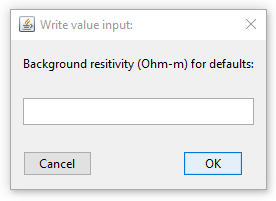

.. _utilEditOptions:

.. include:: <isonum.txt>

Edit the utility's options
==========================

To change the options of the utility, click on the utility item, select the menu showing its class (e.g., ``Interpolate Model utility``):

**[utility class]** |rarr| **Edit options**

.. figure:: ../../../images/utilityMenu.png
    :align: center
    :width: 400

.. _utilEditOptions_E3DMT:

E3DMT Mesh Utility
------------------

- Enter an estimate background resistivity value. This value is used to estimate the necessary padding distances.

- Input Options (`related documentation for E3DMT <https://e3dmt.readthedocs.io/en/e3dmt/content/inputfiles/createOcTree.html>`_)

	.. figure:: ../../../images/utilityE3DMTMeshEditOption_panel1.png
	    :align: center
	    :width: 600

.. important:: Regarding the *shift_data* button. If MT data are used to design the survey, *shift_data* will create a receivers file that places all receivers on the discretized surface. If ZTEM data are used to design the survey, *shift_data* will create a receivers file such that true flight height is preserved over the discretized surface.

.. _utilEditOptions_E3DMTv2:

E3DMT v2 Mesh Utility
---------------------

- Enter an estimate background resistivity value. This value is used to estimate the necessary padding distances.

- Input Options (`related documentation for E3DMT v2 <https://e3dmt.readthedocs.io/en/e3dmt_v2/content/inputfiles/createOcTree.html>`_)

	.. figure:: ../../../images/utilityE3DMTv2MeshEditOption_panel1.png
	    :align: center
	    :width: 600

.. important:: Regarding the *shift_data* button. If MT data are used to design the survey, *shift_data* will create a receivers file that places all receivers on the discretized surface. If ZTEM data are used to design the survey, *shift_data* will create a receivers file such that true flight height is preserved over the discretized surface.

.. _utilEditOptions_E3Dver2Tiled:

E3D_ver2_Tiled Mesh Utility
---------------------------

- Enter an estimate background resistivity value. This value is used to estimate the necessary padding distances.

- Input Options (`related documentation for E3D v2 tiled <https://e3d.readthedocs.io/en/latest/content/inputfiles/createOcTree.html#create-octree-mesh-input-file>`_)

	.. figure:: ../../../images/utilityE3DMeshEditOption_panel2.png
	    :align: center
	    :width: 600

	- Core cell dimension
		- East, North and Thickness dimension of the smallest octree level

	- Octree Refinement Level
		- Power of expension (Min. fact.): Integer value of power 2
		- Minimum cell size (min_cell_size_fwd): Sets the minimum cell size for the forward mesh, factor of base core cell.
		- Maximum topography-based cell size (max_topo_cell): Largest cell before rapid octree expansion.

	- Padding cell expansion
		- Distance to expand outside the core region along the Cartesian directions.

	- Topography
		- Value: Assume flat topography at given elevation (m)
		- Object: Topography defined by a ``TOPOdata`` object

	- Core Region refinement (Inversion)
		- Sets the discretization depth for the first three octree levels (global inversion mesh)

	- Core region refinement (Forward)
		- Sets the discretization depth for the first three octree levels (local forward meshes)

	- Number of cells around Rx
		- Number of cells around each receiver for the first three octree levels

	- Make polygon
		- Value: Distance (m) outside the data convex haul
		- Object: Points defining the outer core region

