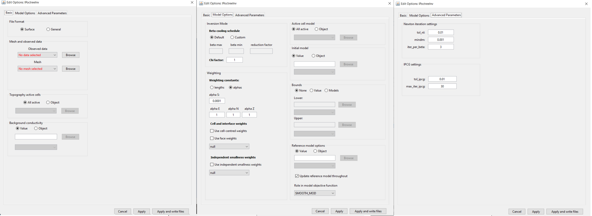

.. _invEditOptions_dcip:

.. include:: <isonum.txt>

Edit Options for DCIP Inversion Objects
***************************************

.. _invEditOptions_dcip2d:

DCIP2D
======

This functionality is responsible for setting all inversion parameters pertaining to the "DC2Dinversion" and "IP2Dinversion" codes; see `DCIP2D online manual <http://dcip2d.readthedocs.io/en/latest/index.html>`__ . The edit options window is comprised of 2 tabs:

    - **Basic:** Sets minimum required input for the inversion

    - **Advanced:** Sets advanced parameters for the inversion, including: the solver, regularization, weights and hard constraints

.. figure:: ../images/dcip2d.png
    :align: center
    :width: 700

    Basic (left), advanced parameters 1 (middle) and advanced parameters 2 (right) tabs.

Units
-----

**Inputs:**

	- **Observed DC data:** observed voltage, normalized by the transmitter current (i.e. :math:`\Delta V/ \! I` )
	- **Observed IP data:** apparent intrinsic chargeabilities (i.e. :math:`\eta_a \in [0,1]`)
	- **Reference/background conductivity model:** S/m
	- **Reference chargeability model:** intrinsic chargeabilities (i.e. :math:`\eta_a \in [0,1]`)

**Outputs:**

	- **Recovered conductivity model:** S/m
	- **Recovered chargeability model:** intrinsic chargeabilities (i.e. :math:`\eta \in [0,1]`)

Basic
-----

	- **Mesh:** mesh for the recovered model

		- **Default (DC only):** The cell size, core region and padding are set automatically based on the electrode spacings and locations. This option will output a mesh object.
		- **Semi-default (DC only):** The user specifies the minimum number of cells between electrodes (*default* = 4) and the aspect ratio (*default* = 2). The aspect ratio is the vertical dimensions of the cells divided by the horizontal width. This options will output a mesh object.
		- **Object:** a mesh object is provided. Reference models, starting models and bound models must all exist on this mesh. For IP inversion, the mesh from the DC inversion must be used.

	- **Observed data:**

		- For DC inversion, the data are the observed voltage, normalized by the transmitter current (i.e. :math:`\Delta V/ \! I` ).
		- For IP inversion, the data are the apparent intrinsic chargeabilities where :math:`\eta_a \in [0,1]`.
		- Data format:
			- **Surface Data Format (recommended)**: Use this data format if the electrodes are at the surface. The Z-values will be excluded from the output data file and the forward modeling code will take care of projecting them at the surface. This avoid the risk of having electrodes in the air or underground.
			- **General Data Format**: Use this option if any electrode is underground. The Z-values are specified in the output data file.

	- **Topography:**

	    - *Default:* Sets topography assuming all electrode are located on the Earth's surface
	    - *Value:* Set the surface to the specified elevation value
	    - *Object:* A 2D topography data object

	- **Conductivity Model (IP inversion only):** Constant value or conductivity model object. Reference and starting models are set in the advanced parameters tab.

Advanced (Parameter 1)
----------------------

**Trade-off parameter:** The inversion choses the optimum trade-off parameter based on the :ref:`chi factor <Fundamentals_Beta_Discrepancy>`.

	- **Chi factor**: sets the target data misfit for the inversion (*default* = 1). :math:`target = C.F. \times \# \, data`.
	- **Max number of iterations:** maximum number of iterations to find optimum trade-off parameter (*default* = 50).

**Inverse solver:** Sets the solver used to determine the model update direction.

	- **SVD:** Singular value decomposition
	- **CG:** Conjugate gradient solver. The user may specify the number of conjugate gradient iterations (*default* = 10) and the accuracy of the solve (*default* = 0.01).

**Length scales:** Sets the weights for smallness and smoothness regularization in x and z; for relevant equations `see manual <http://dcip2d.readthedocs.io/en/latest/content/backgroundtheory.html#equation-intMOF>`__ .

	- **Default:** Sets the values of *alpha S*, *alpha X* and *alpha Z* based on cell dimensions
	- **Alphas:** Sets specific values for *alpha S*, *alpha X* and *alpha Z*
	- **Lengths:** User sets values *Len E* and *Len Z* which define the values of *alpha X* and *alpha Z* relative to *alpha S*. These relationships are given by :math:`L_x = \sqrt{\frac{\alpha_x}{\alpha_s}}` and :math:`L_z = \sqrt{\frac{\alpha_z}{\alpha_s}}`.

**Bounds:** Here, the user specified the lower and upper bounds for the inverted physical property values. For both lower and upper bounds, the user may choose from the following options:

	- **None:** No bounds
	- **Value:** A constant value applied to all cells
	- **Object:** A model object containing a distinct bound value for every cell

**Output files:** Here, the user controls the number of output files. They may choose to output every iteration of the inversion or just the final result

**Wave:** To solve the 2D forward problem, the problem must be solved in the wave domain. *N* specifies the number of log-distribution waves numbers used between *Min* and *Max*. The default is set to: *N* = 13, *Min* = 2.5e-4 and *Max* = 1.

**Huber norm:** Here, the user specifies the norm for the data misfit. For description of the data misfit see the `DCIP2D manual <http://dcip2d.readthedocs.io/en/latest/content/backgroundtheory.html#equation-phid>`__ .

	- **Default data misfit:** the data misfit is defined by an :math:`L_2 \!` -norm
	- **Huber norm:** the data misfit is defined by the Huber norm and the user may specify the Huber constant (:math:`c`).

Advanced (Parameter 2)
----------------------

**Model objective function norm:** Here, the user specifies the norm for the smallness and smoothness in X and Z. Background information regarding the model objective function norm and relevant parameters can be found within the `DCIP2D manual <http://dcip2d.readthedocs.io/en/latest/content/backgroundtheory.html#equation-intMOF>`__

	- **Default norm:** an :math:`L_2 \!`-norm is used for the smallness and smoothness terms
	- **Ekblom norm (CG solver only):** The Ekblom norm can be used to recover more compact and blockier models. For each term in the model objective function, the user specifies the parameters :math:`\epsilon` and :math:`\rho`.

**Reference model:** Here, the user specifies the reference model used in the inversion. There are 3 choices:

	- **Default:** no reference model is used
	- **Value:** a constant reference model is used
	- **Object:** the user specifies a model object as the reference model

**Role in the model objective function:** Here, the user chooses from the following 2 options in the case a reference model is used:

	- **SMALLEST MODEL ONLY:** The reference model is only used in the smallness term. The inversion attempts to preserve the structures found in the reference model.
	- **ALL DERIVATIVES:** The reference model is used in the smallness and smoothness terms. The inversion attempts to preserve the structures and gradients found the in the reference model.

**Initial model:** The user specifies the starting model. There are 3 choices:

	- **Default:** the best-fitting half spaced is used as a starting model
	- **Value:** a constant reference model is used
	- **Object:** the user specifies a model object as the reference model

.. _invDCIP3DCreateSensWeights:

**Weighting functions:** Here, the user may choose not to include additional model weights (**none**) or include face/model weights using a weights object or sensitivity-based weighting. (see section :ref:`Import sensitivity as weights <importSensWeights>`).
	- **no weighting**: no weight is applied
	- **Sensitivity weighting**: If this latest option is chosen, the program will be called a first time to compute the sensitivity matrix. GIFtools will then automatically load the sensitivity, compute the weight and launch the full inversion (see :ref:`fundamentals section <sensW_for_dcip_demo>`).
		- On cells center: the sensitivity weights are applied to the smallness term
		- On faces: the sensitivity weights are applied on the gradient terms.
		- threshold: apply a threshold to the sensitivity weights
	- **Choose weighting GIFmodel**: select a GIFmodel to use as weights

**DCinversion** |rarr| **Discrete Topo/Weights** |rarr| **Create Sensitivity Weights**

.. math::
	\mathbf{w_s} = \mathbf{J}_{approx} / max(\mathbf{J}_{approx}) + \delta

.. math::
	\mathbf{w_x} = \mathbf{A}_c^{f_x}\mathbf{w_s}

.. math::
	\mathbf{w_y} = \mathbf{A}_c^{f_y}\mathbf{w_s}

.. math::
	\mathbf{w_z} = \mathbf{A}_c^{f_z}\mathbf{w_s}

where :math:`\mathbf{w_s}`, :math:`\mathbf{w_s}`, :math:`\mathbf{w_s}` and
:math:`\mathbf{w_s}` are the cell-center and cell-face weights,
:math:`\mathbf{J}_{approx}` are the values from the ``sensitivity.txt`` file,
values from :math:`\delta` is a user-defined threhold parameter ([DEFAULT=1e-2]) and :math:`\mathbf{A}_c^{f_x}, \mathbf{A}_c^{f_y},
\mathbf{A}_c^{f_z}` are averaging operators taking the cell-center values to the respective faces.

**Active cells:** If all cells are updated during the inversion, set as **null**. If an active cells model is supplied, only the cells which are set as active will be updated during the inversion. The values of the remaining cells are determined by the starting model.

.. _invEditOptions_dcip3d:

DCIP3D v5.5
===========

.. figure:: ../images/dc3d.png
    :align: center
    :width: 700

    Inversion parameters tab (left), Models and constraints tab (right).

Functionality specific to the ``DCIPinversion`` object

Inversion Parameters Tab
------------------------

**Mesh:** The 3D tensor mesh file used in the DC or IP inversion

**Observed Data:** a *DC3Ddata* or *IP3Ddata* object

**Data format:** the *surface* and *general* buttons are used to set whether the output observed data file is formatted as surface data or in general format (usually borehole).

**Topography:**

	- **TOPOdata:** An xyz *TOPOdata* object. If you leave as *null*, the topography will correspond to the top of your mesh.

	- **ACTIVEmodel:** An *ACTIVEmodel* object that defines which cells are above and below the surface topography.

	- **IDX file:** File path to an idx file. This is a special file which can be used to define topography for the DCIP3D coding package.

**Conductivity model (IP inversion only):** Define a constant value for all Earth cells or provide a GIFmodel.

**Wavelet parameters:** Define parameters for the wavelet compression for the sensitivity matrix. For more on these parameters, see the `DCIP3D v5.5 manual <https://dcip3d.readthedocs.io/en/latest/content/runprog/dcinv.html#parameter-definitions>`__ .

**Vector memory:** Specifies how solution vectors are to be stored in the computer’s memory. For more on these parameters, see the `DCIP3D v5.5 manual <https://dcip3d.readthedocs.io/en/latest/content/runprog/dcinv.html#parameter-definitions>`__ .

**Forward problem - Solver tolerance:** Sets the relative tolerance for the accuracy of the solution of the forward problem.

Models and Constraints Tab
--------------------------

**Inversion Mode:** Either use the discrepancy principle to choose the optimum trade-off parameter or fix the trade-off parameter for the optimization. For more on these parameters, see the `DCIP3D v5.5 manual <https://dcip3d.readthedocs.io/en/latest/content/runprog/dcinv.html#parameter-definitions>`__ .

**Sensitivity Matrix:** The *Default* option is selected if the user must form the sensitivity matrix for the problem. If you have done an inversion with the same data and mesh, you can use the *already exists* option to set the file path to the sensitivity matrix binary file.

**Weighting:** Sets the weights for smallness and smoothness regularization in x, y and z; for relevant equations :ref:`fundamentals of inversion <Fundamentals_alphas>`

	- **Default:** Sets the values of *alpha S*, *alpha X*, *alpha Y* and *alpha Z* based on cell dimensions
	- **Alphas:** Sets specific values for *alpha S*, *alpha X*, *alpha Y* and *alpha Z*
	- **Lengths:** User sets values *Len E*, *Len N* and *Len Z* which define the values of *alpha X*, *alpha Y* and *alpha Z* relative to *alpha S*.

**Weights object:**

	- *No weighting:* select if you have not created sensitivity weighting yet or if no weighting is being applied.

	- *Weights object:* A GIFweights object that represents sensitivity weights or an additional weights object. Note that when creating sensitivity weights, you can multiply this weights object by the sensitivity weights.

**Active cells:** An *ACTIVEmodel* which denotes active cells in the inversion. If *null*, the active cells are determined by the topography.

**Initial model:**

	- *Value:* A constant background value

	- *Object:* GIFmodel object

	- *Default:* best-fitting halfspace

**Reference model:**

	- *Value:* A constant background value

	- *Object:* GIFmodel object

	- *Default:* best-fitting halfspace

**Role in model objective function:** To see the difference between *SMOOTH_MOD* and *SMOOTH_MOD_DIF* , see the :ref:`fundamentals of inversion <Fundamentals_SmoothInDiff>` .

.. _invEditOptions_dcipoctree:

DCIP Octree
===========

.. important:: This manual contains the documentation for DCIP octree package releases beginning on 2020-05-08. This version of the package is **compatible with GIFtools v2.31 and later**. If using an earlier version of GIFtools, everything is essentially the same except for the *independent smallness weights* option.

    Basic (left), model options (middle) and advanced parameters (right) tabs.

tol_nl mindm iter_per_beta
        The first parameter tol_nl defines a tolerance for the relative gradient at each :math:`\beta` step: tol_nl :math:`= ||g|| / ||g_o||`, where :math:`g` is the current gradient and :math:`g_o` is the gradient at the start of the current :math:`\beta` step iteration. If the relative gradient is less than tol_nl, then the code exits the current :math:`\beta` iteration and decreases :math:`\beta` by the beta_factor.

        mindm defines the smallest allowable model perturbation (if the model perturbation :math:`\Delta m` recovered as a result of IPCH iteration is smaller than mindm, then the current :math:`\beta` iteration is terminated and :math:`\beta` is reduced by beta_factor before the next beta step.

        iter_per_beta sets the maximum number of times that the model can be updated within a given beta iteration.

tol_ipcg max_iter_ipcg
        tol_ipcg is the tolerance to which the IPCG iteration needs to solve the model perturbation. This defines how well the system :math:`J^T J + \beta W_m^T W_m` is solved.

        max_iter_ipcg defines the maximum number of IPCG iterations allowed per :math:`\beta` step to solve for the model perturbation.

Update reference model throughout
        This parameter provides the optional capability to change the reference model at each beta step. If the option is selected, then the reference model is updated every time the regularization parameter changes and is set to the last recovered model from the previous iteration. This may result in quicker convergence. If the option is not used, then the same reference model, as originally defined in line 4 is used throughout the inversion.

SMOOTH_MOD | SMOOTH_MOD_DIF
        This option is used to define the reference model in and out of the derivative terms of the model objective function. The options are: SMOOTH_MOD_DIF (reference model is defined in the derivative terms of the model objective function) and SMOOTH_MOD (reference model is defined only the smallest model term of the objective function).

Smallness weights
		The latest DCIP octree code allows the user to specify cells weights which impact the smallness term in the model objective function.

.. note::
	more details in the `dcipOctree manual <https://dcipoctree.readthedocs.io/en/latest/content/inputfiles/ipinversion.html>`_.
